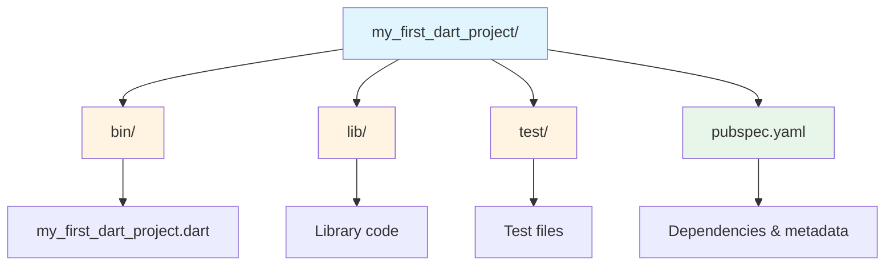
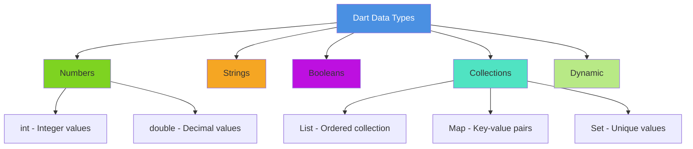
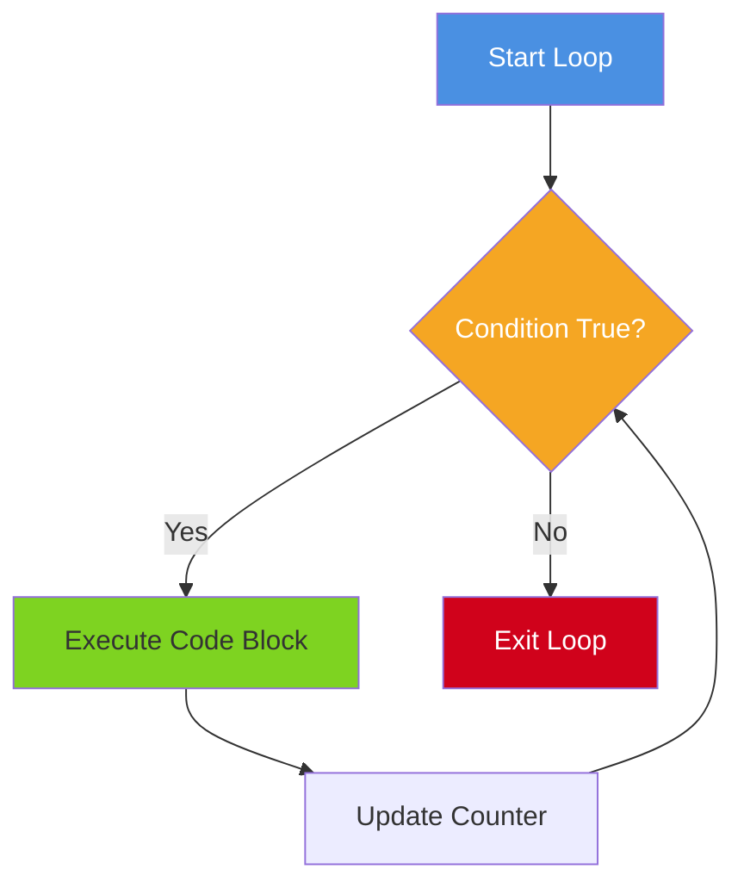
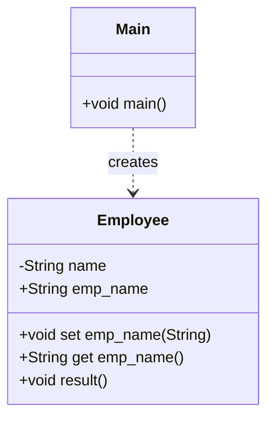

# Lab 1: Introduction to Dart Programming

Welcome to the first lab session for OS2. This lab introduces **Dart**, the programming language that powers Flutter. You will learn fundamental programming concepts including variables, control flow, functions, and object-oriented programming.

---

## Table of Contents
1. [Prerequisites & Setup](#prerequisites--setup)
2. [Introduction to Dart](#introduction-to-dart)
3. [Variables and Data Types](#variables-and-data-types)
4. [Decision Making and Loops](#decision-making-and-loops)
5. [Functions](#functions)
6. [Object-Oriented Programming](#object-oriented-programming)
7. [Lab Exercises](#lab-exercises)
8. [Additional Resources](#additional-resources)

---

## Prerequisites & Setup

Before starting with Dart programming, you need to set up your development environment.

### Option 1: Using DartPad (Online - No Installation Required)

The easiest way to get started is using **DartPad**, an online Dart editor.

1. Open your browser and navigate to [https://dartpad.dev](https://dartpad.dev)
2. You can immediately start writing and running Dart code
3. Perfect for quick experiments and learning

**Advantages:**
- No installation required
- Works on any device with a browser
- Instant code execution

**Limitations:**
- Limited features compared to full IDE
- No project management capabilities

---

### Option 2: Local Installation (Recommended)

For a complete development experience, install Dart and a code editor locally.

#### Step 1: Install Dart SDK

**Windows:**
1. Download the Dart SDK from [https://dart.dev/get-dart](https://dart.dev/get-dart)
2. Alternatively, use Chocolatey package manager:
   ```bash
   choco install dart-sdk
   ```
3. Verify installation:
   ```bash
   dart --version
   ```

**macOS:**
1. Use Homebrew:
   ```bash
   brew tap dart-lang/dart
   brew install dart
   ```
2. Verify installation:
   ```bash
   dart --version
   ```

**Linux (Debian/Ubuntu):**
1. Install via apt-get:
   ```bash
   sudo apt-get update
   sudo apt-get install apt-transport-https
   wget -qO- https://dl-ssl.google.com/linux/linux_signing_key.pub | sudo gpg --dearmor -o /usr/share/keyrings/dart.gpg
   echo 'deb [signed-by=/usr/share/keyrings/dart.gpg arch=amd64] https://storage.googleapis.com/download.dartlang.org/linux/debian stable main' | sudo tee /etc/apt/sources.list.d/dart_stable.list
   sudo apt-get update
   sudo apt-get install dart
   ```
2. Verify installation:
   ```bash
   dart --version
   ```

#### Step 2: Install a Code Editor

**Visual Studio Code (Recommended):**
1. Download from [https://code.visualstudio.com/download](https://code.visualstudio.com/download)
2. Install the **Dart** extension:
   - Open VS Code
   - Go to Extensions (Ctrl+Shift+X or Cmd+Shift+X)
   - Search for "Dart" and install the official extension by Dart Code

**Android Studio (Alternative):**
1. Download from [https://developer.android.com/studio](https://developer.android.com/studio)
2. Install the **Dart** plugin:
   - Go to File > Settings > Plugins
   - Search for "Dart" and install

---

### Creating Your First Dart Project

Once you have Dart installed, you can create a project using the command line.

**Step 1: Create a new project**
```bash
dart create my_first_dart_project
```

**Step 2: Navigate to the project directory**
```bash
cd my_first_dart_project
```

**Step 3: Run the default program**
```bash
dart run
```

---

### Understanding Project Structure

After creating a project, you will see the following directory structure:



**Directory Breakdown:**
- **bin/**: Contains the main executable file (entry point of your application)
- **lib/**: Used for reusable library code
- **test/**: Contains unit tests for your code
- **pubspec.yaml**: Project configuration file (dependencies, metadata)

---

### Running Dart Code

There are multiple ways to execute Dart programs:

**Option 1: Run the entire project**
```bash
dart run
```

**Option 2: Run a specific file**
```bash
dart run bin/my_first_dart_project.dart
```

**Option 3: Execute a standalone Dart file**
```bash
dart path/to/file.dart
```

---

## Introduction to Dart

Dart is a general-purpose programming language with a C-style syntax. It supports modern programming concepts such as:
- Classes and interfaces
- Generics
- Asynchronous programming
- Strong typing with type inference

**Key Feature:** Dart does not support traditional arrays. Instead, it uses collections (Lists, Maps, Sets) to manage data structures.

### Your First Dart Program

The entry point of every Dart application is the `main()` function:

```dart
void main() {
    print("Dart language is easy to learn");
}
```

**Explanation:**
- `void`: The function does not return a value
- `main()`: The entry point function
- `print()`: Outputs text to the console

---

## Variables and Data Types

In Dart, a **variable** is a named storage location, and **data types** define the size and type of data that can be stored.

### Variable Declaration

```dart
var name = "Dart";        // Type inference
int age = 25;             // Explicit type
dynamic data = 100;       // Can change type at runtime
```

### Constants

Use `final` or `const` to declare values that won't change.

**Difference:**
- **final**: Value is set at runtime (can be computed)
- **const**: Value is set at compile-time (must be a constant expression)

```dart
void main() {
    final a = 12;
    const pi = 3.14;
    print(a);
    print(pi);
}
```

---

### Supported Data Types

Dart supports various built-in data types:



#### 1. Numbers

Dart supports two types of numbers:

```dart
int count = 10;           // Integer
double price = 99.99;     // Double (floating-point)
```

#### 2. Strings

A sequence of characters enclosed in single or double quotes:

```dart
String message = "Hello, Dart!";
String name = 'Student';
```

**String Interpolation:**
```dart
String name = "Ahmed";
print("Hello, $name!");              // Output: Hello, Ahmed!
print("Next year I'll be ${25 + 1}"); // Output: Next year I'll be 26
```

#### 3. Booleans

Represents `true` or `false`:

```dart
bool isStudent = true;
bool hasPassed = false;
```

#### 4. Lists

Ordered collection of items (similar to arrays):

```dart
void main() {
    var list = [1, 2, 3, 4, 5];
    print(list);              // Output: [1, 2, 3, 4, 5]
    print(list[0]);           // Output: 1
}
```

#### 5. Maps

Collection of key-value pairs:

```dart
void main() {
    var mapping = {'id': 1, 'name': 'Dart'};
    print(mapping);           // Output: {id: 1, name: Dart}
    print(mapping['name']);   // Output: Dart
}
```

#### 6. Dynamic Type

If you don't specify a type, Dart uses `dynamic`:

```dart
void main() {
    dynamic name = "Dart";
    print(name);
    
    name = 100;  // Type can change
    print(name);
}
```

---

## Decision Making and Loops

Control flow statements allow you to execute code based on conditions or repeat code blocks.

### Decision Making Statements

Dart supports the following conditional statements:
- `if`
- `if-else`
- `else-if`
- `switch`

**Example:**
```dart
void main() {
    int score = 85;
    
    if (score >= 90) {
        print("Excellent");
    } else if (score >= 75) {
        print("Good");
    } else {
        print("Needs Improvement");
    }
}
```

---

### Loops

Loops allow you to repeat a block of code multiple times.

**Loop Flow Diagram:**



#### Loop Types

**1. for loop:**
```dart
for (var i = 1; i <= 5; i++) {
    print(i);
}
```

**2. for-in loop:**
```dart
var list = [1, 2, 3];
for (var item in list) {
    print(item);
}
```

**3. while loop:**
```dart
int i = 1;
while (i <= 5) {
    print(i);
    i++;
}
```

**4. do-while loop:**
```dart
int i = 1;
do {
    print(i);
    i++;
} while (i <= 5);
```

---

### Example: Print Even Numbers

The following code prints even numbers from 1 to 10:

```dart
void main() {
    for(var i = 1; i <= 10; i++) {
        if (i % 2 == 0) {
            print(i);
        }
    }
}
```

**Output:**
```
2
4
6
8
10
```

---

## Functions

A **function** is a group of statements that performs a specific task. Functions help organize code and promote reusability.

### Function Syntax

```dart
returnType functionName(parameters) {
    // Function body
    return value;
}
```

### Example: Addition Function

```dart
void main() {
    add(3, 4);
}

void add(int a, int b) {
    int c;
    c = a + b;
    print(c);
}
```

**Output:**
```
7
```

---

### Function with Return Value

```dart
int multiply(int a, int b) {
    return a * b;
}

void main() {
    int result = multiply(5, 3);
    print("Result: $result");  // Output: Result: 15
}
```

---

## Object-Oriented Programming

Dart is an **object-oriented programming (OOP)** language. It uses **classes** as blueprints to create **objects**.

### Class Components

A class typically includes:
1. **Fields** (variables)
2. **Getters and Setters** (accessors)
3. **Constructors** (initialization)
4. **Methods** (functions)

---

### Class Structure Diagram



---

### Example: Employee Class

```dart
class Employee {
    String name;
    
    // Getter method
    String get emp_name {
        return name;
    }
    
    // Setter method
    void set emp_name(String name) {
        this.name = name;
    }
    
    // Function definition
    void result() {
        print(name);
    }
}

void main() {
    // Object creation
    Employee emp = new Employee();
    emp.name = "employee1";
    emp.result();  // Output: employee1
}
```

**Explanation:**
- `Employee`: Class name
- `name`: Field (instance variable)
- `emp_name`: Getter and setter for the name field
- `result()`: Method to print the employee name
- `new Employee()`: Creates an instance of the Employee class

---

## Lab Exercises

### Exercise 1: Calculator

Write a Dart program that:
1. Takes two numbers and an operator (+, -, *, /) as input
2. Uses a `switch` statement to perform the operation
3. Prints the result

**Expected Output Example:**
```
Enter first number: 10
Enter second number: 5
Enter operator (+, -, *, /): *
Result: 50
```

---

### Exercise 2: FizzBuzz

Write a program that prints numbers from 1 to 20:
- If the number is divisible by 3, print "Fizz"
- If the number is divisible by 5, print "Buzz"
- If divisible by both 3 and 5, print "FizzBuzz"
- Otherwise, print the number

**Expected Output:**
```
1
2
Fizz
4
Buzz
Fizz
7
8
Fizz
Buzz
11
Fizz
13
14
FizzBuzz
...
```

---

### Exercise 3: Student Management System

Create a `Student` class with the following:
- **Fields**: `name` (String), `id` (int), `gpa` (double)
- **Method**: `isHonors()` returns `true` if GPA >= 3.5
- **Method**: `displayInfo()` prints student details

In the `main()` function:
1. Create at least 3 student objects
2. Display their information
3. Print whether each student is an honors student

---

### Exercise 4: Prime Number Checker

Write a function `isPrime(int number)` that:
- Returns `true` if the number is prime
- Returns `false` otherwise

Test your function with numbers: 2, 7, 15, 23, 30

---

## Additional Resources

- [Flutter/Dart Tutorial (TutorialsPoint)](https://www.tutorialspoint.com/flutter/flutter_introduction_to_dart_programming.htm)
- [Dart & Flutter YouTube Playlist](https://www.youtube.com/playlist?list=PLoMmMinVeSkud4SURAo6ccR6MduZWTdTq)
- [Official Dart Documentation](https://dart.dev/guides)
- [DartPad Online Editor](https://dartpad.dev)

---

**End of Lab 1**
