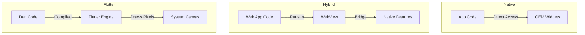

# Lab: Introduction to Flutter Development

## 📌 Overview
This lab introduces the Flutter framework, compares different mobile development approaches, and guides students through setting up and coding their first Flutter application using Android Studio. The content is based on the foundational concepts of Native, Hybrid, and Cross-Platform development.

## 🎯 Learning Objectives
By the end of this lab, students should be able to:
1. Understand the difference between Native, Hybrid, and Cross-Platform (Flutter) development.
2. Explain the core pillars of the course: UI, State Management, Networking, and Animation.
3. Set up a Flutter project in Android Studio.
4. Write a basic Flutter application using `MaterialApp`, `Center`, and `Container` widgets.

---

## 1. Introduction to Flutter
Flutter is a platform that allows developers to build high-quality mobile applications for iOS and Android. It is increasingly popular due to its future potential and the strong backing from Google, which ensures long-term support.

### Why Learn Flutter?
*   **Future-Proofing:** The job market is trending towards technologies like Flutter, which allow rapid development for multiple platforms.
*   **Efficiency:** It enables building apps that look and perform like native applications, sometimes even surpassing them in UI consistency.
*   **Prerequisites:** Students should have a solid understanding of Object-Oriented Programming (OOP) before diving deep into Flutter.

---

## 2. Mobile Development Architectures

To understand how Flutter works, it is essential to compare it with other development methodologies.

### A. Native Development
*   **Mechanism:** You build separate apps using the specific SDKs provided by Apple (iOS) or Google (Android).
*   **Pros:** Best performance, direct access to latest device features immediately upon release.
*   **Cons:** Expensive and time-consuming as it requires maintaining two separate codebases (e.g., Java/Kotlin for Android and Swift/Obj-C for iOS).

### B. Hybrid Development
*   **Mechanism:** Uses web technologies (HTML/CSS/JS) wrapped in a **WebView**. The app runs essentially as a website inside a native container. It uses a "Bridge" to communicate with native hardware (like Bluetooth).
*   **Pros:** Code reusability across platforms.
*   **Cons:** Performance issues, harder debugging, and reliance on plugins for native features. If a native feature is new, you must wait for a plugin wrapper to be created.

### C. Cross-Platform (Flutter)
*   **Mechanism:** Flutter does not use a WebView or native OEM widgets. Instead, it asks the system for a blank **Canvas** and uses its own rendering engine to draw every pixel of the UI.
*   **Language:** Uses **Dart**, which compiles to native code.
*   **Pros:** High performance (60 FPS), consistent UI across devices, and the **Hot Reload** feature, which allows you to see code changes instantly without restarting the app.

### 📊 Architecture Comparison



---

## 3. Course Methodology
This course focuses on building maintainable, high-quality code. The curriculum is structured around four main pillars:

1.  **User Interface (UI):** Building the visual layout of the application.
2.  **State Management:** Handling data changes and app states efficiently.
3.  **Networking:** Connecting to APIs and handling server data.
4.  **Animation:** Adding visual flair to the user experience.

---

## 4. Hands-On: Your First Flutter App

### Step 1: Project Setup
1.  Open **Android Studio**.
2.  Select **"Start a new Flutter project"**.
3.  Choose **Flutter Application** and click Next.
4.  **Project Name:** Must be lowercase (e.g., `test_app` or `my_first_app`).
5.  **Company Domain:** Used to generate the package name (e.g., `com.example.myapp`).
6.  Click **Finish** and wait for the project to index.

### Step 2: Understanding the Environment
Once the project opens, you will see the default counter app.
*   **Emulator:** You can run the app on an Android Emulator, iOS Simulator, or even a web browser.
*   **Hot Reload:** A key feature where changes in the code are reflected almost instantly in the app without losing state.

### Step 3: Writing Code
We will clear the default code and write a minimal app from scratch.

1.  **Main Entry Point:**
    Every Flutter app starts with the `main()` function which calls `runApp()`.

2.  **The Widget Tree:**
    Flutter uses **Widgets** for everything. The root widget is often `MaterialApp`.

    ```dart
    import 'package:flutter/material.dart';

    void main() {
      runApp(
        MaterialApp(
          home: Center(
            child: Container(
              color: Colors.red, // Sets the container color to red
              width: 40.0,      // Sets width
              height: 40.0,     // Sets height
              child: Text('Hi'), // Text inside the container
            ),
          ),
        ),
      );
    }
    ```

3.  **Code Analysis:**
    *   `MaterialApp`: The core widget that sets up the material design style.
    *   `Center`: A layout widget that centers its child within the screen.
    *   `Container`: A versatile widget used for styling (colors, dimensions).
    *   `Text`: Displays a string of text.

### 🛠️ Troubleshooting Tip
If the layout looks strange (e.g., text appears with yellow underlines or red formatting), it is often because the widget lacks default text styling provided by a `Scaffold` or `Material` widget. For this basic example, `MaterialApp` provides enough context for the `Container` to render.

---

## 📝 Lab Task
1.  Create a new Flutter project named `lab_one_intro`.
2.  Replace the default code with a `MaterialApp`.
3.  Use a `Center` widget to position a `Container` in the middle of the screen.
4.  Set the container's color to blue and its size to `100.0` by `100.0`.
5.  Add a child `Text` widget inside the container with your initials.

