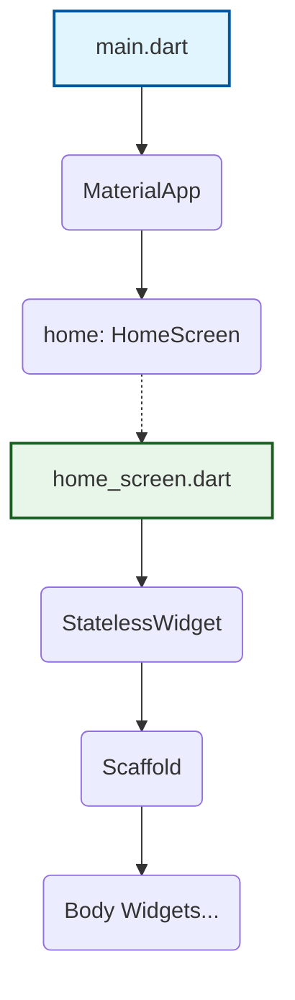
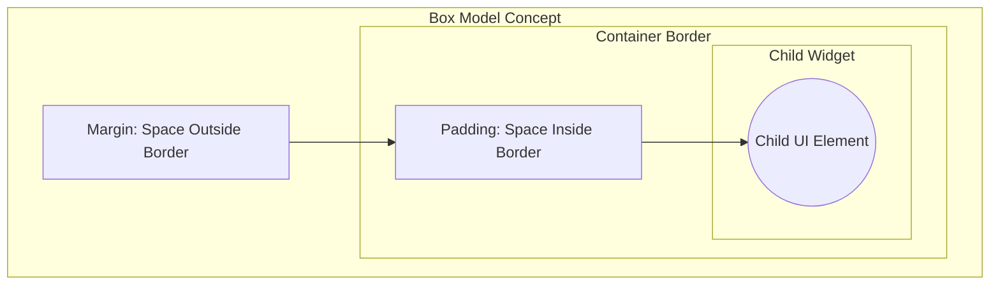
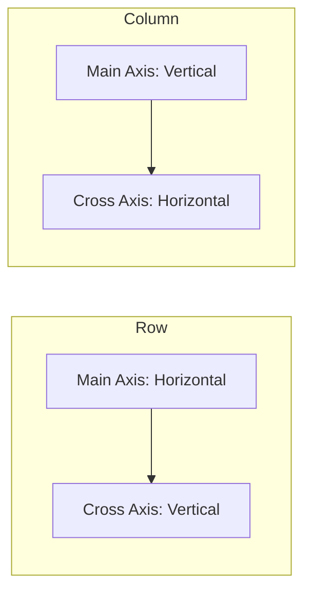

# Lab: Flutter UI Basics, Layouts, and Code Organization

## 1. Objective
This lab document provides a comprehensive guide for Computer Science students to understand the foundational concepts of building user interfaces (UI) in Flutter. By the end of this lab, students will be familiar with debugging techniques, image rendering, code organization through `StatelessWidget`, and structural layouts using `Container`, `Row`, and `Column`.

---

## 2. Debugging and Self-Learning
A core skill in software development is the ability to independently resolve issues. When encountering errors in your Flutter application, it is highly recommended to build a habit of investigating the problem rather than getting stuck.

*   **IDE Error Highlighting:** Modern IDEs will highlight syntax or structural errors. Hovering over the error will often display a tooltip explaining the exact issue.
*   **Searching for Solutions:** If the IDE's tooltip does not solve the problem, copy the error message and search for it on search engines or platforms like StackOverflow. This approach will save significant time and help you understand common pitfalls.

### Example

Suppose you write this code and see a red underline in your IDE:

```dart
// ERROR: Missing comma between properties
Container(
  color: Colors.blue
  width: 100, // IDE highlights this line
)
```

Hovering over the error shows: `Expected to find ','`. The fix is simple:

```dart
// FIXED: Added the missing comma
Container(
  color: Colors.blue,
  width: 100,
)
```

If you encounter a runtime error like `RenderFlex overflowed by 42 pixels`, copy that message and search for it online. You will find that it means your content is too large for the available space, and solutions typically involve wrapping content in a `SingleChildScrollView` or using `Expanded`/`Flexible`.

---

## 3. Essential UI Widgets

### 3.1. Core Wrappers: `MaterialApp` and `Scaffold`
When building a Flutter application, you need base widgets to set up the visual structure:
*   **`MaterialApp`:** Serves as the main wrapper for the entire application, providing default styling, themes, and navigation capabilities.
*   **`Scaffold`:** A widget typically placed inside `MaterialApp` (often as the home screen). It provides a standard app structure, allowing you to easily add UI components like an App Bar, a floating action button, and the main `body`.

#### Example

```dart
import 'package:flutter/material.dart';

void main() {
  runApp(
    MaterialApp(
      debugShowCheckedModeBanner: false,
      home: Scaffold(
        appBar: AppBar(
          title: Text('My First App'),
          backgroundColor: Colors.teal,
        ),
        body: Center(
          child: Text(
            'Hello, Flutter!',
            style: TextStyle(fontSize: 24),
          ),
        ),
        floatingActionButton: FloatingActionButton(
          onPressed: () {},
          child: Icon(Icons.add),
        ),
      ),
    ),
  );
}
```

This creates a basic app with:
- An **AppBar** at the top with title "My First App"
- A **body** showing centered text
- A **FloatingActionButton** in the bottom-right corner

### 3.2. Adding Images
Flutter allows you to integrate images into your application from different sources. The two primary methods covered are:
1.  **Network Images (`Image.network`):** Used to load images directly from the internet using a URL. You can also specify properties such as width and height.
2.  **Asset Images (`Image.asset`):** Used to load local images stored within the project files.
    *   To use local assets, you must first create a folder (e.g., `images`) and place your image files inside it.
    *   Next, you must register this folder in the `pubspec.yaml` file under the `assets` section so the application knows where to find them.

#### Example: Network Image

```dart
Scaffold(
  body: Center(
    child: Image.network(
      'https://picsum.photos/300/200',
      width: 300,
      height: 200,
      fit: BoxFit.cover,
    ),
  ),
)
```

#### Example: Asset Image

**Step 1:** Create an `images` folder at the root of your project and add a file like `logo.png`.

**Step 2:** Register it in `pubspec.yaml`:

```yaml
flutter:
  assets:
    - images/logo.png
    # Or include the entire folder:
    # - images/
```

**Step 3:** Use it in your code:

```dart
Scaffold(
  body: Center(
    child: Image.asset(
      'images/logo.png',
      width: 200,
      height: 200,
    ),
  ),
)
```

---

## 4. Code Organization: `StatelessWidget`
As your UI grows, placing all your code in a single block becomes unmanageable. It is best practice to organize and separate your code.

Instead of writing a massive tree of widgets inside the main file, you should extract parts of your UI into separate custom classes extending `StatelessWidget`.
*   **The `build` Method:** Every `StatelessWidget` requires a `build` method. This method is responsible for returning the widget tree (the UI) for that specific component.
*   **File Separation:** For better organization, each custom screen or major widget should be placed in its own separate `.dart` file (e.g., a `home_screen.dart` file) and then imported into the `main.dart` file.



### Example

**File: `main.dart`**

```dart
import 'package:flutter/material.dart';
import 'home_screen.dart';

void main() {
  runApp(
    MaterialApp(
      home: HomeScreen(),
    ),
  );
}
```

**File: `home_screen.dart`**

```dart
import 'package:flutter/material.dart';

class HomeScreen extends StatelessWidget {
  const HomeScreen({super.key});

  @override
  Widget build(BuildContext context) {
    return Scaffold(
      appBar: AppBar(
        title: Text('Home Screen'),
      ),
      body: Center(
        child: Column(
          mainAxisAlignment: MainAxisAlignment.center,
          children: [
            Icon(Icons.home, size: 80, color: Colors.teal),
            SizedBox(height: 16),
            Text(
              'Welcome to the Home Screen!',
              style: TextStyle(fontSize: 20),
            ),
          ],
        ),
      ),
    );
  }
}
```

This keeps `main.dart` clean and focused only on launching the app, while `home_screen.dart` contains all the UI logic for that screen.

---

## 5. Layout Spacing: Container, Padding, and Margin

To control spacing and wrap other widgets, Flutter provides the `Container`, `Padding`, and `Margin` concepts. A `Container` is a widget that wraps a single child and allows you to apply styling, alignment, and spacing.

It is crucial to understand the difference between Margin and Padding:
*   **Margin:** The distance between the external border of the widget and the elements outside of it.
*   **Padding:** The distance between the internal border of the widget and the child content inside of it.

If you only need padding without applying colors or specific structural constraints, you can use the standalone `Padding` widget instead of a full `Container`. Additionally, the `Center` widget can be used to explicitly center a child widget within its parent.



### Example: Container with Margin and Padding

```dart
Scaffold(
  body: Center(
    child: Container(
      margin: EdgeInsets.all(20),    // 20px space OUTSIDE the box
      padding: EdgeInsets.all(16),   // 16px space INSIDE the box
      decoration: BoxDecoration(
        color: Colors.blue[100],
        border: Border.all(color: Colors.blue, width: 2),
        borderRadius: BorderRadius.circular(12),
      ),
      child: Text(
        'I have margin and padding!',
        style: TextStyle(fontSize: 18),
      ),
    ),
  ),
)
```

### Example: Standalone Padding Widget

```dart
// When you only need padding (no color, no border):
Padding(
  padding: EdgeInsets.symmetric(horizontal: 24, vertical: 12),
  child: Text('I only need padding, not a full Container.'),
)
```

### Example: Center Widget

```dart
// Explicitly center a widget inside its parent:
Center(
  child: Text('I am centered!'),
)
```

---

## 6. Aligning Multiple Elements: Row and Column

When you need to display multiple widgets together, `Container` is not enough because it only takes a single child. Instead, you use layouts that accept a list of `children`.

### 6.1. Row (Horizontal Layout)
The `Row` widget aligns its children horizontally side-by-side.
*   **Main Axis:** Horizontal.
*   **Cross Axis:** Vertical.

#### Example

```dart
Row(
  children: [
    Icon(Icons.star, color: Colors.amber, size: 40),
    Icon(Icons.star, color: Colors.amber, size: 40),
    Icon(Icons.star, color: Colors.amber, size: 40),
    Icon(Icons.star_border, color: Colors.amber, size: 40),
    Icon(Icons.star_border, color: Colors.amber, size: 40),
  ],
)
```

This displays 5 star icons in a horizontal line (3 filled, 2 empty) — like a rating bar.

### 6.2. Column (Vertical Layout)
The `Column` widget aligns its children vertically, placing them one below the other.
*   **Main Axis:** Vertical.
*   **Cross Axis:** Horizontal.

#### Example

```dart
Column(
  children: [
    CircleAvatar(
      radius: 50,
      backgroundImage: NetworkImage('https://picsum.photos/200'),
    ),
    SizedBox(height: 12),
    Text(
      'John Doe',
      style: TextStyle(fontSize: 22, fontWeight: FontWeight.bold),
    ),
    SizedBox(height: 4),
    Text(
      'Flutter Developer',
      style: TextStyle(fontSize: 16, color: Colors.grey),
    ),
  ],
)
```

This creates a simple profile card with an avatar image on top, followed by a name and title stacked vertically.

### 6.3. Alignment Properties
Both `Row` and `Column` offer properties to define how their children are distributed across the available space:
*   **`mainAxisAlignment`:** Controls how children are placed along the primary axis (e.g., centering items horizontally in a Row or vertically in a Column).
*   **`crossAxisAlignment`:** Controls how children are aligned along the secondary axis. Note: Cross-axis alignment relies on having a defined boundary. If the `Row` or `Column` doesn't have a specific height/width or a parent `Container` defining its boundaries, cross-axis alignment might not visually alter the layout because the widget shrinks to fit the children.



#### Example: MainAxisAlignment

```dart
// Evenly space items across the row
Row(
  mainAxisAlignment: MainAxisAlignment.spaceEvenly,
  children: [
    ElevatedButton(onPressed: () {}, child: Text('Save')),
    ElevatedButton(onPressed: () {}, child: Text('Cancel')),
    ElevatedButton(onPressed: () {}, child: Text('Delete')),
  ],
)
```

Common values:
| Value | Effect |
|-------|--------|
| `MainAxisAlignment.start` | Pack children at the start (default) |
| `MainAxisAlignment.center` | Center children along the axis |
| `MainAxisAlignment.end` | Pack children at the end |
| `MainAxisAlignment.spaceBetween` | Equal space between children, no space at edges |
| `MainAxisAlignment.spaceEvenly` | Equal space between and around children |
| `MainAxisAlignment.spaceAround` | Half space at edges, full space between |

#### Example: CrossAxisAlignment

```dart
// Align children to the start (left) of a Column
Container(
  height: 300,
  width: double.infinity,
  color: Colors.grey[200],
  child: Column(
    crossAxisAlignment: CrossAxisAlignment.start,
    children: [
      Text('Title', style: TextStyle(fontSize: 24, fontWeight: FontWeight.bold)),
      Text('Subtitle goes here', style: TextStyle(fontSize: 16)),
      Text('Description text aligned to the left.'),
    ],
  ),
)
```

#### Example: Combining Row and Column

```dart
Scaffold(
  body: Padding(
    padding: EdgeInsets.all(16),
    child: Column(
      crossAxisAlignment: CrossAxisAlignment.start,
      children: [
        // Header Row
        Row(
          mainAxisAlignment: MainAxisAlignment.spaceBetween,
          children: [
            Text('My App', style: TextStyle(fontSize: 24, fontWeight: FontWeight.bold)),
            Icon(Icons.settings),
          ],
        ),
        SizedBox(height: 20),
        // Content
        Text('Welcome back!', style: TextStyle(fontSize: 18)),
        SizedBox(height: 12),
        // Button Row
        Row(
          children: [
            Expanded(
              child: ElevatedButton(
                onPressed: () {},
                child: Text('Profile'),
              ),
            ),
            SizedBox(width: 12),
            Expanded(
              child: ElevatedButton(
                onPressed: () {},
                child: Text('Settings'),
              ),
            ),
          ],
        ),
      ],
    ),
  ),
)
```

This builds a simple screen layout with a header row (title + icon), welcome text, and two side-by-side buttons.

### 6.4. Safe Area
When placing layouts on a modern mobile device, UI elements might overlap with hardware features like camera notches or software features like the system status bar. To prevent this, wrap your main layout in a `SafeArea` widget. `SafeArea` automatically adds necessary padding to ensure your content is fully visible and not hidden behind operating system interfaces.

#### Example

```dart
Scaffold(
  body: SafeArea(
    child: Column(
      children: [
        Text(
          'This text will NOT overlap with the status bar or notch!',
          style: TextStyle(fontSize: 18),
        ),
        SizedBox(height: 20),
        Text('All content is safely visible.'),
      ],
    ),
  ),
)
```

Without `SafeArea`, the first `Text` widget might be hidden behind the phone's status bar or camera notch. With `SafeArea`, Flutter automatically adds the necessary top padding.
