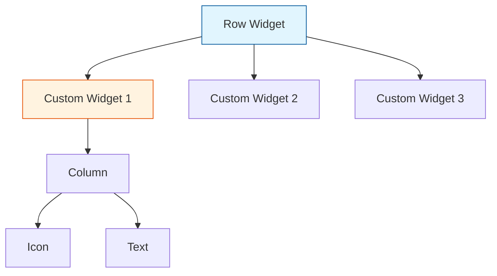
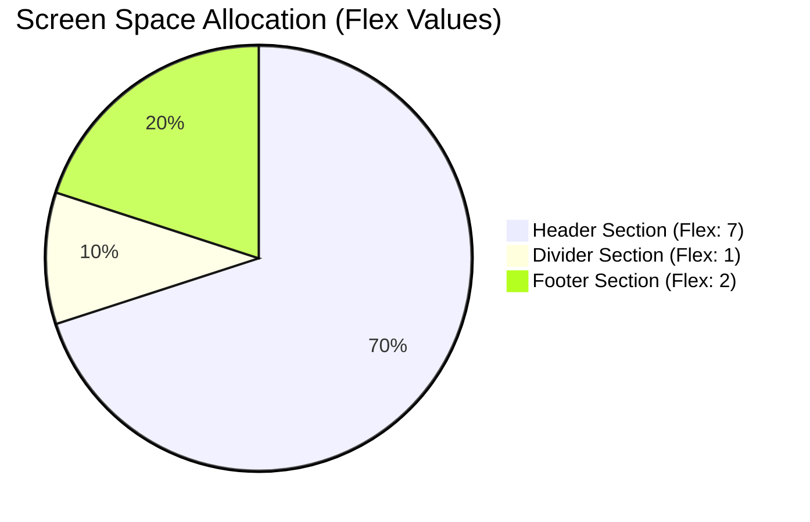
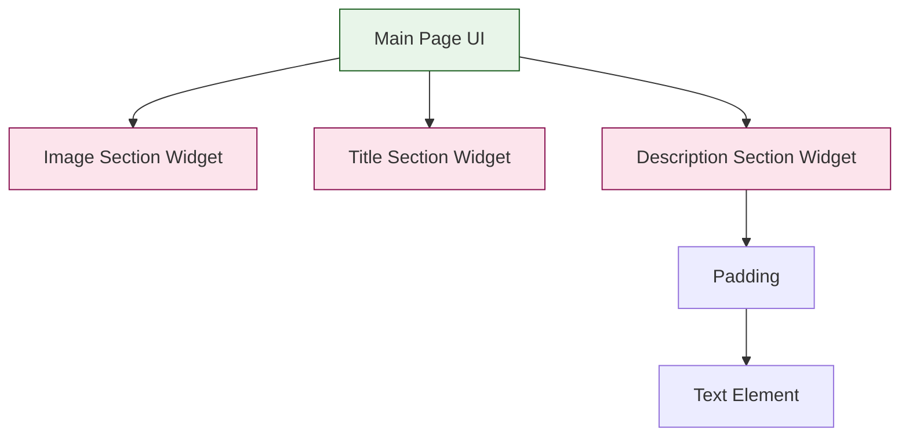

# Lab: Advanced UI Layouts, Space Management, and Code Organization

## Overview
Welcome to this lab on User Interface (UI) layout design. In this session, we will focus on building responsive and well-structured interfaces. You will learn how to properly utilize foundational layout widgets, manage screen space proportionally, organize your UI code for maximum reusability, and separate your data from the UI layer using models.

---

## 1. Basic Layouts: Rows and Columns
The building blocks of UI design involve placing elements either horizontally or vertically.
* To align elements horizontally across the screen, use the `Row` widget.
* To align elements vertically (one below the other), use the `Column` widget.

A very common UI pattern combines both. For example, if you need to build a custom button that has an icon with text directly beneath it, you will place the icon and the text inside a `Column`, and then place that `Column` inside a `Row` alongside other elements.

### Example: Row with Columns inside it

```dart
Row(
  mainAxisAlignment: MainAxisAlignment.spaceEvenly,
  children: [
    Column(
      children: [
        Icon(Icons.home, size: 30),
        Text('Home'),
      ],
    ),
    Column(
      children: [
        Icon(Icons.search, size: 30),
        Text('Search'),
      ],
    ),
    Column(
      children: [
        Icon(Icons.person, size: 30),
        Text('Profile'),
      ],
    ),
  ],
)
```

This produces a bottom-navigation-style bar where each item is an icon stacked above its label.

### Code Reusability
When building interfaces, you will often find yourself repeating the same combination of widgets. To maintain clean code and avoid duplication, you should extract these repeated UI elements into separate, reusable custom widgets or functions. By passing parameters (such as the specific text or icon) to these custom components, you can dynamically render different variations of the same layout using a single block of code.

### Example: Reusable custom widget with parameters

Instead of copy-pasting the icon+label combination three times, extract it into a widget:

```dart
// Define the reusable widget once
class NavItem extends StatelessWidget {
  final IconData icon;
  final String label;

  const NavItem({required this.icon, required this.label});

  @override
  Widget build(BuildContext context) {
    return Column(
      children: [
        Icon(icon, size: 30),
        Text(label),
      ],
    );
  }
}

// Use it three times with different data — no code duplication
Row(
  mainAxisAlignment: MainAxisAlignment.spaceEvenly,
  children: [
    NavItem(icon: Icons.home,   label: 'Home'),
    NavItem(icon: Icons.search, label: 'Search'),
    NavItem(icon: Icons.person, label: 'Profile'),
  ],
)
```



---

## 2. Space Management: Expanded vs. Flexible
When working with different screen sizes, your layout must adapt. Hardcoding fixed sizes can cause layout issues.

### The `Expanded` Widget
The `Expanded` widget is used within a `Row` or `Column` to force a child widget to take up all the remaining available space. This is highly useful when you have some fixed-size elements (like an icon) and want the text next to it to stretch to the end of the screen.

### Example: Expanded fills leftover space

```dart
Row(
  children: [
    Icon(Icons.label),          // Fixed size — takes only what it needs
    Expanded(
      child: Text(
        'This text stretches to fill the rest of the row',
        overflow: TextOverflow.ellipsis,
      ),
    ),
    Icon(Icons.arrow_forward),  // Fixed size — appears at the far right
  ],
)
```

Without `Expanded`, the `Text` widget would only take as much space as its content needs. With `Expanded`, it fills whatever space remains between the two icons.

### The `Flexible` Widget
The `Flexible` widget allows you to allocate screen space proportionally using percentages. Instead of giving a fixed height or width, you define a `flex` property. The system calculates the total available space by summing all the `flex` values, and then assigns space based on the ratio.

For example, if you have three UI sections and assign them `flex` values of 7, 1, and 2, the total is 10. The screen will automatically be divided so the first element takes 70%, the second takes 10%, and the third takes 20% of the space.

### Example: Flexible divides space proportionally

```dart
Column(
  children: [
    Flexible(
      flex: 7,
      child: Container(
        color: Colors.blue[100],
        child: Center(child: Text('Header — 70%')),
      ),
    ),
    Flexible(
      flex: 1,
      child: Container(
        color: Colors.grey[300],
        child: Center(child: Text('Divider — 10%')),
      ),
    ),
    Flexible(
      flex: 2,
      child: Container(
        color: Colors.green[100],
        child: Center(child: Text('Footer — 20%')),
      ),
    ),
  ],
)
```

The three sections share the screen height in the ratio 7:1:2 — no matter what device size is used.



### Expanded vs. Flexible — Quick Comparison

| Widget     | Behaviour |
|------------|-----------|
| `Expanded` | Always fills **all** remaining space (equivalent to `Flexible` with `fit: FlexFit.tight`) |
| `Flexible`  | Takes **up to** its proportional share; the child can be smaller |

*Note on Images*: When placing images inside flexible layouts or containers, they might not automatically size correctly. You must adjust the fitting properties on the image to ensure it covers the assigned container space perfectly without distorting.

```dart
Flexible(
  flex: 7,
  child: Image.asset(
    'assets/header.jpg',
    fit: BoxFit.cover,   // Covers the container without distortion
    width: double.infinity,
  ),
)
```

---

## 3. UI Code Organization
When building a full application page, putting all your code in a single file makes it difficult to read and maintain.

You should divide the screen into logical, modular sections (for example, an image header, a title area, action buttons, and a description block). Once conceptualized, extract the code for each of these sections into separate custom widgets.

You can then apply styling, such as using the `Padding` widget, to create appropriate spacing around the elements and ensure they don't touch the screen edges. Furthermore, alignment properties can be used to push elements to the right or left inside your layout structures.

### Example: Breaking one large screen into small section widgets

**Before** — everything crammed into one `build` method:

```dart
// Hard to read, hard to maintain
@override
Widget build(BuildContext context) {
  return Scaffold(
    body: Column(
      children: [
        Image.asset('assets/photo.jpg', height: 250, fit: BoxFit.cover),
        Padding(
          padding: const EdgeInsets.all(16),
          child: Align(
            alignment: Alignment.centerLeft,
            child: Text('Product Title', style: TextStyle(fontSize: 24, fontWeight: FontWeight.bold)),
          ),
        ),
        Padding(
          padding: const EdgeInsets.symmetric(horizontal: 16),
          child: Text('A long description of the product goes here...'),
        ),
      ],
    ),
  );
}
```

**After** — each section is its own widget:

```dart
// Clean main page — reads like an outline
@override
Widget build(BuildContext context) {
  return Scaffold(
    body: Column(
      children: [
        ImageSection(),
        TitleSection(),
        DescriptionSection(),
      ],
    ),
  );
}

// ── Separate widget files ──────────────────────────────

class ImageSection extends StatelessWidget {
  @override
  Widget build(BuildContext context) {
    return Image.asset(
      'assets/photo.jpg',
      height: 250,
      width: double.infinity,
      fit: BoxFit.cover,
    );
  }
}

class TitleSection extends StatelessWidget {
  @override
  Widget build(BuildContext context) {
    return Padding(
      padding: const EdgeInsets.all(16),
      child: Align(
        alignment: Alignment.centerLeft,
        child: Text(
          'Product Title',
          style: TextStyle(fontSize: 24, fontWeight: FontWeight.bold),
        ),
      ),
    );
  }
}

class DescriptionSection extends StatelessWidget {
  @override
  Widget build(BuildContext context) {
    return Padding(
      padding: const EdgeInsets.symmetric(horizontal: 16),
      child: Text('A long description of the product goes here...'),
    );
  }
}
```



---

## 4. Integrating Data Models
Currently, you might be hardcoding text and values directly into your UI widgets. This is not an optimal practice. To make your application scalable, you should isolate your data from your user interface.

You achieve this by creating a Data Model (a standard class containing properties like name, description, etc.). Instead of writing strings directly into the UI, you pass instances of this model to your custom widgets, allowing the UI to dynamically render whatever data it receives.

### Example: Defining a data model

```dart
// product.dart — pure data, no UI code
class Product {
  final String name;
  final String description;
  final String imageUrl;
  final double price;

  const Product({
    required this.name,
    required this.description,
    required this.imageUrl,
    required this.price,
  });
}
```

### Example: A list of products (mock data)

```dart
// data.dart — sample data kept separate from the UI
const List<Product> products = [
  Product(
    name: 'Wireless Headphones',
    description: 'Noise-cancelling over-ear headphones with 30 h battery.',
    imageUrl: 'assets/headphones.jpg',
    price: 79.99,
  ),
  Product(
    name: 'Mechanical Keyboard',
    description: 'Compact tenkeyless keyboard with blue switches.',
    imageUrl: 'assets/keyboard.jpg',
    price: 54.99,
  ),
];
```

### Example: Widget receives a model instead of raw strings

```dart
// product_card.dart — UI that works with ANY Product instance
class ProductCard extends StatelessWidget {
  final Product product;   // accepts a model, not separate strings

  const ProductCard({required this.product});

  @override
  Widget build(BuildContext context) {
    return Card(
      child: Column(
        crossAxisAlignment: CrossAxisAlignment.start,
        children: [
          Image.asset(product.imageUrl, fit: BoxFit.cover),
          Padding(
            padding: const EdgeInsets.all(12),
            child: Column(
              crossAxisAlignment: CrossAxisAlignment.start,
              children: [
                Text(product.name,
                    style: TextStyle(fontSize: 18, fontWeight: FontWeight.bold)),
                const SizedBox(height: 4),
                Text(product.description),
                const SizedBox(height: 8),
                Text('\$${product.price.toStringAsFixed(2)}',
                    style: TextStyle(color: Colors.green, fontSize: 16)),
              ],
            ),
          ),
        ],
      ),
    );
  }
}

// Render all products with a single list — no hardcoding
ListView(
  children: products.map((p) => ProductCard(product: p)).toList(),
)
```

Now adding a new product only requires adding one entry to the `products` list — the UI updates automatically.

---

## 🛠️ Practice Assignment
Your task for this lab is to build a complete UI screen utilizing all the concepts discussed.
1. Map out the screen into logical sections.
2. Use `Row` and `Column` widgets to build the basic structure.
3. Apply `Expanded` and `Flexible` where appropriate to ensure the screen scales properly across devices.
4. Separate the different sections into clean, independent custom widgets.
