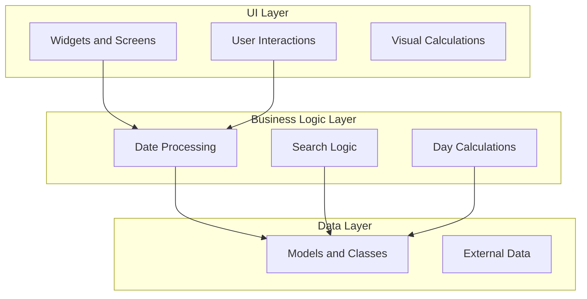
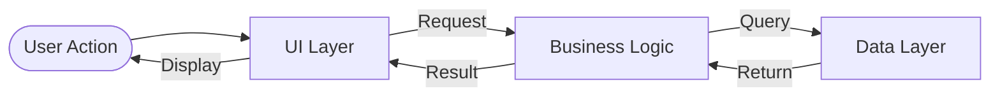
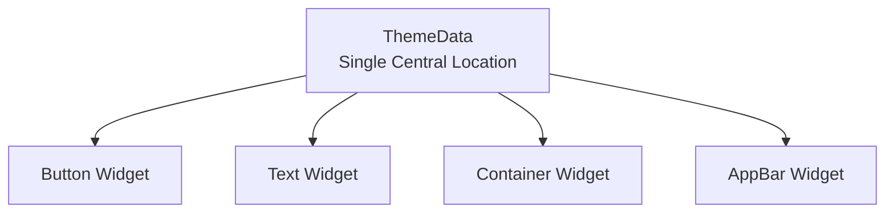
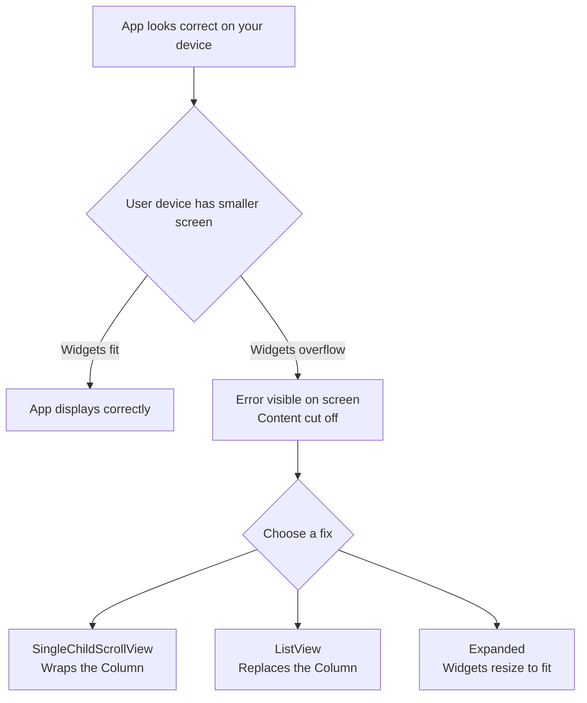
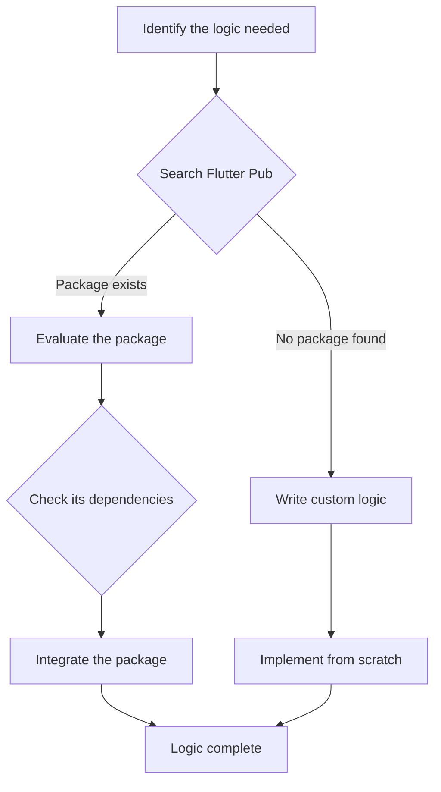

# Lab 05: Building a Complete Flutter App — Architecture to Logic

## Overview

This lab guides you through the full process of building a complete Flutter application from scratch. You will learn how to **plan requirements before writing code**, structure your app using a clean **three-layer architecture**, manage colors with **centralized theming**, solve **scrolling and screen-size issues**, design **data model classes**, and build a **logic layer** that calculates real values and uses external packages.

---

## Objectives

By the end of this lab you will be able to:

- Define app requirements before writing any code
- Separate UI, Business Logic, and Data into distinct layers
- Apply the DRY principle to write maintainable Flutter code
- Handle UI constraints and user interaction events
- Implement centralized theming using `Theme.of(context)` and `ThemeData`
- Fix layout overflow errors caused by varying device screen sizes
- Create Dart model classes to represent structured data
- Build a logic-layer widget with strict data type enforcement
- Search and integrate packages from the Flutter Pub repository

---

## Prerequisites

- Familiarity with Flutter widgets (`Column`, `Row`, `Text`, `Container`)
- Basic Dart class syntax
- A running Flutter development environment

---

## Background

### The Three-Layer Architecture

Before writing a single line of code, every professional Flutter app starts with a clear separation of responsibilities. This is the most fundamental principle in building maintainable apps.



**Why this matters:** When you hardcode logic directly in the UI, every update forces you to change multiple places at once. A well-structured app lets you change things in exactly **one place**. If you find yourself making the same change in multiple locations, this is a clear sign that your code is poorly organized.

---

## Planning: Defining Requirements

The very first step in building any application is **not opening the code editor** — it is defining exactly what the application needs to do. This is called defining the program requirements.

### What Are Requirements?

Requirements specify:

- What actions the user should be able to take
- What visual elements the app must display
- What data the app needs to access and process

### The Three Layers in Detail

Once requirements are defined, you organize your app into three isolated layers:

| Layer | Responsibility | Examples |
|-------|---------------|---------|
| **UI** | Visual elements, user input, screen layout | Widgets, buttons, text |
| **Business Logic** | Calculations, processing, rules | Date calculations, search filtering |
| **Data** | Storing and supplying raw information | Model classes, data sources |

The critical rule is: **the UI layer never directly touches the data layer.** The Business Logic layer acts as the bridge.



### Task 1 — Write a Requirements Document

Before starting any code this session, write a requirements document for a simple personal profile app:

1. List every screen the app will have
2. For each screen, describe: what the user sees, what the user can do, and what data the screen needs
3. Identify which items belong to the UI layer, which to the Business Logic layer, and which to the Data layer

### Task 2 — Draw a Separation of Concerns Diagram

Pick one feature (for example, a search function):

1. Draw a block diagram with three sections: **UI**, **Business Logic**, and **Data**
2. Trace how a user's search input flows from the UI to the Business Logic to the Data layer and back
3. Ensure no arrows connect UI directly to Data — they must always pass through Business Logic

---

## UI Best Practices

### The `build` Method and Widget Layout

The `build` method is where Flutter constructs your UI. Widgets inside it are placed **directly under one another** and executed using consistent logic.

```dart
@override
Widget build(BuildContext context) {
  return Column(
    children: [
      Text('First Item'),
      SizedBox(height: 60),   // spacing greater than 50 pixels
      Text('Second Item'),
      SizedBox(height: 60),
      Text('Third Item'),
    ],
  );
}
```

**Line-by-line explanation:**
- `Column` — arranges children vertically, one below the other
- `SizedBox(height: 60)` — adds a gap of 60 pixels between widgets
- Each `Text` widget is placed sequentially under the previous one, executed with the same layout logic

### The DRY Principle — Code Maintainability

**DRY stands for: Don't Repeat Yourself.**

The core rule:

> If you want to change something and you must change it in **more than one place**, your code is written poorly. Well-written code allows you to make that change in **exactly one place**.

**Anti-pattern — color repeated in every widget:**

```dart
Container(color: Color(0xFF1565C0), child: Text('Header')),
Container(color: Color(0xFF1565C0), child: Text('Section')),
Container(color: Color(0xFF1565C0), child: Text('Footer')),
```

Changing the color requires updating three separate lines.

**DRY pattern — color defined once:**

```dart
final primaryColor = Color(0xFF1565C0);

Container(color: primaryColor, child: Text('Header')),
Container(color: primaryColor, child: Text('Section')),
Container(color: primaryColor, child: Text('Footer')),
```

Now you change the color in one place and all three containers update instantly.

### User Interaction: Displaying Item Details

When a user clicks on an item, the app should immediately display the details specific to that individual element:

- **Step 1:** User taps on an item
- **Step 2:** The app triggers a response that reveals that item's specific details

```dart
GestureDetector(
  onTap: () {
    showDetails(item);  // displays details for this specific item
  },
  child: ListTile(title: Text(item.name)),
)
```

### Setting Constraints — Minimum Values

You can define the smallest size an element is allowed to take:

```dart
Container(
  constraints: BoxConstraints(
    minWidth: 100,   // smallest possible width
    minHeight: 50,   // smallest possible height
  ),
  child: Text('Content'),
)
```

This ensures the element never shrinks below the specified threshold regardless of its content.

### Reusing Code Logic for Data Reception

When a user finishes making a selection, the app should use consistent, reusable logic to receive and process the selected data:

```dart
// Reusable handler called after any selection completes
void onSelectionComplete(SelectedItem item) {
  processSelection(item);  // same logic handles all selection results
}
```

### Task 3 — Refactor Repeated Code

1. Open your Flutter project and find any widget where the same style (color, padding, or text style) is written in three or more places
2. Extract that style into a single variable or constant
3. Replace all occurrences with the variable
4. Change the variable once and confirm all instances update simultaneously

### Task 4 — Add Interaction and Constraints

1. Create a list of three items displayed in a `Column`
2. Wrap each item in a `GestureDetector` that shows a `SnackBar` with that item's name when tapped
3. Add a `Container` with `BoxConstraints` that sets a `minWidth` of 150 and `minHeight` of 80
4. Verify the container respects the minimum size even when its content is very small

---

## Centralized Theming with `Theme.of`

### The Problem: Hardcoded Colors

When you set a color directly on each widget, the app becomes impossible to update globally:

```dart
// BAD — same color hardcoded on every element
ElevatedButton(
  style: ButtonStyle(
    backgroundColor: MaterialStateProperty.all(Color(0xFF1565C0)),
  ),
  child: Text('Submit'),
  onPressed: () {},
),
Text('Title', style: TextStyle(color: Color(0xFF1565C0))),
Container(color: Color(0xFF1565C0), child: Text('Box')),
```

To implement dark mode or a new brand color, you must locate and update every single line.

### The Solution: Centralized Theming

Define design properties **once** in a `ThemeData` object. All widgets reference this single source:

```dart
MaterialApp(
  theme: ThemeData(
    primaryColor: Color(0xFF1565C0),
    colorScheme: ColorScheme.fromSeed(
      seedColor: Color(0xFF1565C0),
    ),
  ),
  home: MyHomePage(),
)
```

### Accessing the Theme — `Theme.of(context)`

Instead of a hardcoded color value, reference the central theme:

```dart
Container(
  color: Theme.of(context).primaryColor,
  child: Text(
    'Hello',
    style: TextStyle(
      color: Theme.of(context).colorScheme.onPrimary,
    ),
  ),
)
```

**Line-by-line explanation:**
- `Theme.of(context)` — looks up the `ThemeData` object defined at the `MaterialApp` level
- `.primaryColor` — retrieves the primary color from that central location
- `.colorScheme.onPrimary` — retrieves the text color designed to contrast with the primary color
- Changing `primaryColor` in `ThemeData` once automatically updates every widget that references it

### Implementing Global Changes — Dark Mode

With centralized theming, applying dark mode is a single-line change:

```dart
MaterialApp(
  theme: ThemeData.light(),
  darkTheme: ThemeData.dark(),
  themeMode: ThemeMode.dark,  // change this one line to switch the entire app
  home: MyHomePage(),
)
```

No widget code changes are needed. The entire app updates through the central `ThemeData`.



### Task 5 — Migrate to Centralized Theming

1. Pick a screen that has three or more widgets using the same hardcoded color
2. Remove all hardcoded color values from those widgets
3. Define a `ThemeData` object in your `MaterialApp` with that color as `primaryColor`
4. Replace each removed color with `Theme.of(context).primaryColor`
5. Change `primaryColor` in `ThemeData` once and verify all widgets update simultaneously

### Task 6 — Toggle Dark Mode

1. Add both `theme: ThemeData.light()` and `darkTheme: ThemeData.dark()` to `MaterialApp`
2. Set `themeMode: ThemeMode.dark`
3. Run the app and observe the complete visual change with zero modifications to any widget

---

## Solving Screen Size and Scrolling Issues

### The Device Fragmentation Problem

Your app's design might look perfect on your development device, but end-users have phones with different screen dimensions — different lengths and different widths. A layout that fits your screen may overflow and become invisible on a smaller device.



When content overflows a `Column`, Flutter renders a visible overflow error (yellow and black stripes) at the edge of the screen.

### The Primary Fix: `SingleChildScrollView`

Take all the widgets inside your `Column` and wrap them in a `SingleChildScrollView`:

```dart
// BEFORE — causes overflow on small screens
Column(
  children: [
    WidgetOne(),
    WidgetTwo(),
    WidgetThree(),
    WidgetFour(),
  ],
)

// AFTER — user can scroll to see all content
SingleChildScrollView(
  child: Column(
    children: [
      WidgetOne(),
      WidgetTwo(),
      WidgetThree(),
      WidgetFour(),
    ],
  ),
)
```

**Line-by-line explanation:**
- `SingleChildScrollView` — a wrapper widget that enables vertical scrolling for its single child
- The `Column` structure remains unchanged inside it
- Users swipe up to reveal widgets that extend beyond the visible screen area
- The overflow error disappears because the content is no longer forced to fit within a fixed boundary

### Alternative 1: `ListView`

Replace the `Column` entirely with a `ListView`, which has scrolling built in natively:

```dart
ListView(
  children: [
    WidgetOne(),
    WidgetTwo(),
    WidgetThree(),
    WidgetFour(),
  ],
)
```

No wrapper needed — `ListView` handles its own scrolling automatically.

### Alternative 2: `Expanded`

Use `Expanded` alongside the widgets inside the `Column` to make them fill and adapt to the available space:

```dart
Column(
  children: [
    Expanded(child: WidgetOne()),  // stretches to fill remaining height
    WidgetTwo(),
  ],
)
```

`Expanded` forces the child to resize and fit within the screen boundaries. The screen does not scroll; instead, the widget adapts its size to fit.

### Choosing Between the Three Approaches

| Approach | When to Use |
|---------|------------|
| `SingleChildScrollView` | Content must stay full-size; user scrolls to see all of it |
| `ListView` | A list of repeating items needs scrolling |
| `Expanded` | Content should shrink to fit the screen without scrolling |

### Task 7 — Trigger and Fix an Overflow Error

1. Create a `Column` with 8 large `Container` widgets, each with `height: 120`
2. Run the app on a small emulator (4-inch device profile)
3. Observe the visible overflow error at the bottom of the screen
4. Wrap the `Column` in a `SingleChildScrollView`
5. Confirm the error disappears and you can scroll through all containers

### Task 8 — Compare All Three Approaches

1. Implement the overflowing list using `SingleChildScrollView` + `Column`
2. Reimplement using only `ListView`
3. Reimplement using `Expanded` (observe: content resizes rather than scrolls)
4. Write a short note comparing what the user experiences in each case

---

## UI Data Models

### What Is a Data Model?

A **data model** is a Dart class that groups related values together. Instead of passing individual, unrelated variables between widgets, you group them into a class. The class becomes the single container for a piece of data and holds those values for as long as they are needed.

### Creating a Basic Data Model

```dart
// person_model.dart
class PersonModel {
  final String name;
  final int age;
  final DateTime birthDate;

  PersonModel({
    required this.name,
    required this.age,
    required this.birthDate,
  });
}
```

**Line-by-line explanation:**
- `class PersonModel` — defines a new Dart class named `PersonModel`
- `final String name` — a value held inside the class: the person's name (cannot be changed after set)
- `final int age` — a value held inside the class: the person's age
- `final DateTime birthDate` — a value held inside the class: the person's date of birth
- `PersonModel({required this.name, ...})` — the constructor; all fields must be provided when creating an instance

### Connecting a Model to a Widget

Pass the model as a typed parameter to the widget that will display its data:

```dart
class PersonCard extends StatelessWidget {
  final PersonModel person;  // only accepts a PersonModel — no other type

  const PersonCard({required this.person, super.key});

  @override
  Widget build(BuildContext context) {
    return Column(
      crossAxisAlignment: CrossAxisAlignment.start,
      children: [
        Text(person.name),
        Text('Age: ${person.age}'),
        Text('Born: ${person.birthDate.year}'),
      ],
    );
  }
}
```

**Usage:**

```dart
PersonCard(
  person: PersonModel(
    name: 'Ahmed',
    age: 22,
    birthDate: DateTime(2003, 5, 15),
  ),
)
```

### Task 9 — Build a Data Model Class

1. Create a new file `lib/models/person_model.dart`
2. Define a `PersonModel` class with three fields: `name` (String), `age` (int), `birthDate` (DateTime)
3. Add a constructor that requires all three fields
4. Create a `StatelessWidget` called `PersonCard` that accepts a `PersonModel` as a required parameter
5. Display all three fields inside the widget using `Text` widgets

### Task 10 — Populate a List from Models

1. Create a `List<PersonModel>` with three entries (different names, ages, birth dates)
2. Use a `Column` to display a `PersonCard` for each item in the list
3. Verify that changing a value inside the `PersonModel` immediately updates the displayed card

---

## The Logic Layer

### What Is the Logic Layer?

The logic layer contains the calculations and processing that your app performs, completely separated from the UI. In this part of the lab, the app builds a widget that **calculates the number of days** associated with a specific person. Calculating days is a business logic task, not a UI task — the UI only displays the result.

### Strict Data Typing in Widgets

A key principle: **a widget must receive exactly the data type it expects.** If the widget is designed to work with a `PersonModel`, passing any other type is an error that Dart will catch at compile time.

```dart
class DaysCalculatorWidget extends StatelessWidget {
  final PersonModel person;  // strictly requires a PersonModel

  const DaysCalculatorWidget({required this.person, super.key});

  int calculateDaysAlive() {
    final today = DateTime.now();
    return today.difference(person.birthDate).inDays;
  }

  @override
  Widget build(BuildContext context) {
    return Text('Days alive: ${calculateDaysAlive()}');
  }
}
```

**Line-by-line explanation:**
- `final PersonModel person` — the constructor enforces strict typing; only a `PersonModel` is accepted
- `calculateDaysAlive()` — the logic function, completely separated from the build method
- `DateTime.now().difference(person.birthDate).inDays` — subtracts the birth date from today and returns the result in full days
- `build` — only displays the result; it does not perform the calculation itself

### The Logic Implementation Workflow

Before writing custom logic from scratch, always ask:

> **Do I actually need to build this myself, or does a ready-made solution already exist?**



### Searching Flutter Pub for Packages

The Flutter package repository (pub.dev) hosts packages created by other developers. Before implementing complex logic manually:

1. Go to **pub.dev**
2. Search for keywords related to your task (for example: "date", "time difference", "age calculator")
3. Evaluate the package's popularity, maintenance status, and license
4. Read its documentation and check its **dependencies** — some packages require other packages to function

### Understanding Dependencies

A dependency is when one package relies on another to work correctly:

```yaml
# pubspec.yaml
dependencies:
  flutter:
    sdk: flutter
  intl: ^0.19.0    # date formatting package added from Pub
```

**How dependencies work:**
- Package A uses Package B internally
- When you add Package A to your project, Package B must also be present
- Running `flutter pub get` resolves and downloads all required dependencies automatically

### Building an Isolated Logic Class

Creating a **complete class** and verifying it independently is an excellent approach to logic development:

```dart
// lib/logic/days_calculator.dart
class DaysCalculator {
  final DateTime birthDate;

  DaysCalculator(this.birthDate);

  int calculateDaysAlive() {
    return DateTime.now().difference(birthDate).inDays;
  }

  bool isOver1000DaysOld() {
    return calculateDaysAlive() > 1000;
  }
}
```

**Line-by-line explanation:**
- `class DaysCalculator` — a pure logic class: no widgets, no UI, no `BuildContext`
- `final DateTime birthDate` — the only input the class needs
- `calculateDaysAlive()` — computes and returns the number of days since birth
- `isOver1000DaysOld()` — uses `calculateDaysAlive()` internally to answer a boolean question
- This class can be tested independently without running the full app

**Verifying the class:**

```dart
void main() {
  final calc = DaysCalculator(DateTime(2003, 5, 15));
  print(calc.calculateDaysAlive());   // prints the number of days
  print(calc.isOver1000DaysOld());    // prints true or false
}
```

### Event Handling in the Logic Layer

The logic layer also handles **events** — situations where something happens and the logic layer must take over to process it. The UI triggers the event; the logic layer processes it; the result goes back to the UI.

```dart
// When a selection event occurs, the logic layer takes over
void onPersonSelected(PersonModel selectedPerson) {
  final calculator = DaysCalculator(selectedPerson.birthDate);
  final days = calculator.calculateDaysAlive();
  displayResult(days);  // passes the result back to the UI
}
```

The logic layer never knows or cares how the result will be displayed.

### Task 11 — Build a Type-Strict Days Calculator Widget

1. Use the `PersonModel` from the previous section
2. Create a `DaysCalculatorWidget` that accepts only a `PersonModel` as its required parameter
3. Implement `calculateDaysAlive()` inside the widget using `DateTime.now().difference(person.birthDate).inDays`
4. Display the result in a `Text` widget
5. Attempt to pass a plain `int` instead of a `PersonModel` to confirm Dart rejects it at compile time

### Task 12 — Research and Integrate a Package

1. Open pub.dev in your browser
2. Search for "date difference" or "age calculator"
3. Find a package that computes date intervals
4. Add it to `pubspec.yaml` and run `flutter pub get`
5. Read the package documentation and identify every dependency it requires
6. Rewrite your days calculation using the package
7. Confirm the output matches your manual calculation

### Task 13 — Isolate Logic into a Separate Class

1. Create a new file `lib/logic/days_calculator.dart`
2. Define a `DaysCalculator` class with a `birthDate` property
3. Add `calculateDaysAlive()` returning an `int`
4. Add `isOver1000DaysOld()` returning a `bool`
5. Run a quick test using `void main()` to print both results for a known birth date
6. Connect the class to `DaysCalculatorWidget` by creating an instance inside the widget

---

## State Management with `StatefulWidget`

### What Is State?

**State** is any data that can change over time and whose change should cause the UI to update. In the Age Calculator, the selected dates and computed results are state — when the user picks a new date, the UI must re-render to show it.

A widget that holds no mutable data is a `StatelessWidget`. A widget that owns data that changes at runtime is a `StatefulWidget`.

### `StatelessWidget` vs `StatefulWidget`

| Type | When to Use | Can Change After Build? |
|------|-------------|------------------------|
| `StatelessWidget` | Display-only, no interaction | No |
| `StatefulWidget` | User input, computed results, anything that updates | Yes, via `setState()` |

### The `StatefulWidget` Pattern

A `StatefulWidget` is split into two classes:

```dart
// 1. The widget itself — immutable, holds configuration
class HomeScreen extends StatefulWidget {
  const HomeScreen({super.key});

  @override
  State<HomeScreen> createState() => _HomeScreenState();
}

// 2. The State object — holds the mutable data
class _HomeScreenState extends State<HomeScreen> {
  DateTime _birthDate = DateTime(2000, 1, 1);  // mutable state
  Map<String, int>? _age;                       // mutable state

  @override
  Widget build(BuildContext context) {
    return Text('$_birthDate');
  }
}
```

**Line-by-line explanation:**
- `StatefulWidget` — the widget class itself is still immutable; it just knows how to create a `State`
- `createState()` — returns the `State` object that will own the mutable data
- `_HomeScreenState` — the private class where all mutable fields live
- `DateTime _birthDate` — a state variable; changing it triggers a rebuild

### `setState()` — The Rebuild Trigger

`setState()` is the mechanism that tells Flutter: "data changed — rebuild the UI."

```dart
// Without setState: data changes but UI stays the same (stale)
_birthDate = newDate;  // UI never updates

// With setState: data changes AND Flutter schedules a rebuild
setState(() {
  _birthDate = newDate;  // UI updates on next frame
});
```

**How it works:**
1. You call `setState(() { ... })` with the data change inside the closure
2. Flutter marks this widget as "dirty"
3. On the next frame, Flutter calls `build()` again with the new data
4. The UI reflects the updated state

### Connecting State to the Three-Layer Architecture

```dart
void _calculate() {
  // DATA LAYER: build the typed model from current state
  final model = AgeInputModel(
    birthDate: _birthDate,
    todayDate: _todayDate,
  );

  // BUSINESS LOGIC LAYER: run the calculation
  final calculator = AgeCalculator(model);

  // UI LAYER: setState triggers rebuild with new results
  setState(() {
    _age = calculator.calculateAge();
    _nextBirthday = calculator.calculateNextBirthday();
  });
}
```

The flow: **user taps CALCULATE → UI layer reads state → creates Data model → passes to Logic layer → Logic returns result → setState() updates UI.**

### Task 14 — Add State to the Age Calculator

1. Convert `HomeScreen` from `StatelessWidget` to `StatefulWidget`
2. Declare `_birthDate`, `_todayDate`, `_age`, and `_nextBirthday` as state variables
3. Call `setState()` inside `onDateSelected` so the date field updates when the user picks a date
4. Call `setState()` inside `_calculate()` after running `AgeCalculator` to show results
5. Call `setState()` inside `_clear()` to reset all fields
6. Verify: pick a new date → field shows new date; press CALCULATE → result boxes fill in; press CLEAR → boxes reset to zero

---

## Summary

| Topic | Key Concept |
|-------|-------------|
| Requirements | Define what the app needs before writing any code |
| UI Best Practices | DRY principle: change in one place, not many |
| Theming | `Theme.of(context)` for centralized color management |
| Scrolling | `SingleChildScrollView` fixes overflow on small screens |
| UI Models | Dart classes hold structured data for widgets |
| Logic Layer | Separate calculations from UI; check Flutter Pub first |
| State Management | `StatefulWidget` + `setState()` for mutable UI data |

The most important takeaway: **architecture comes first.** Planning the three layers — UI, Business Logic, and Data — before writing code is what makes a Flutter app maintainable and professional.
