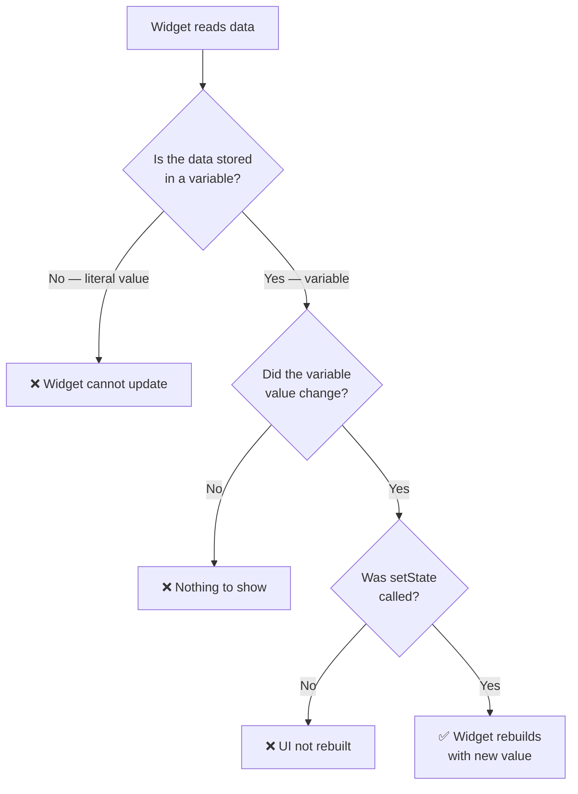
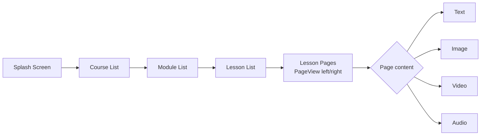
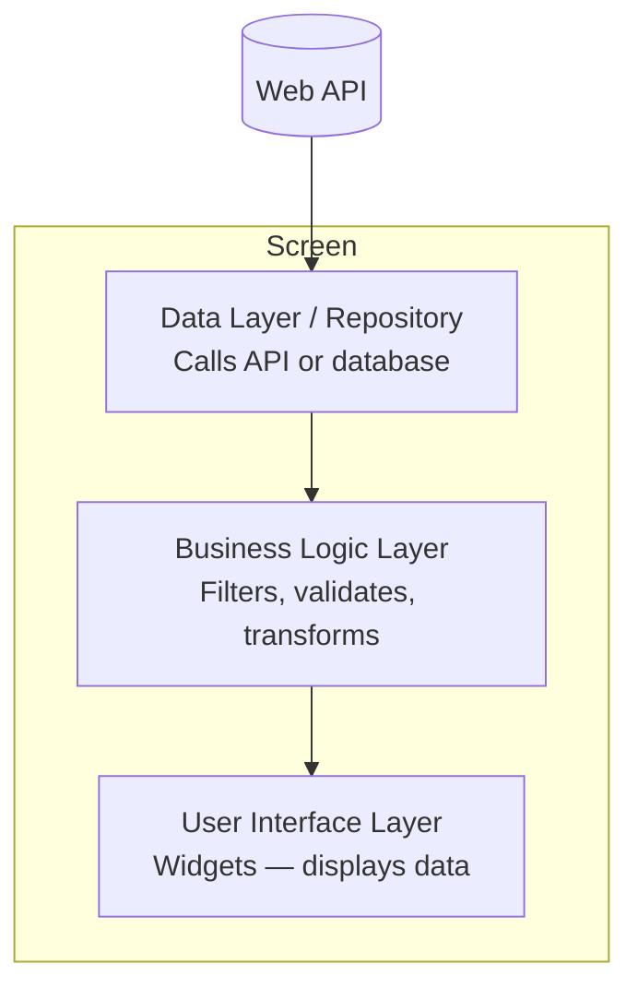
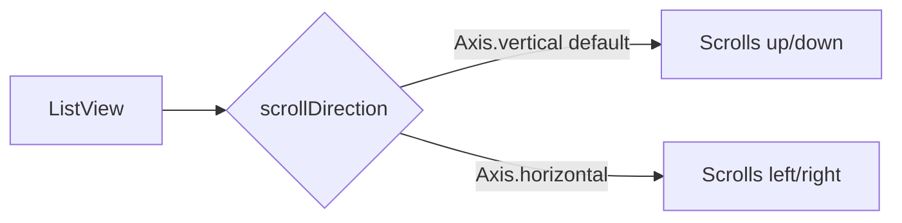
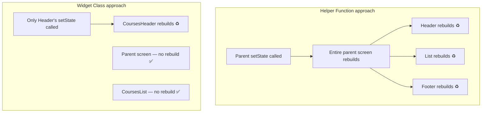

# Lab 06: State Management, ListViews, and UI Architecture

## Overview

This lab covers four foundational Flutter topics that take you from a static app to a dynamic, data-driven application. You will learn how to make widgets respond to user input using **state management**, display dynamic collections with **ListView**, plan a real-world project using a **three-layer architecture**, and organise your UI code properly using **helper functions vs. widget classes**.

---

## Objectives

By the end of this lab you will be able to:

- Explain what "state" means in a Flutter application
- Convert a `StatelessWidget` to a `StatefulWidget` and call `setState()`
- Format dates using the `intl` package
- Plan a multi-screen Flutter project before writing any code
- Display lists of data using `ListView`, `ListView.builder`, and `ListView.separated`
- Decide when to extract UI code into a helper function vs. a separate widget class
- Understand how widget build lifecycles affect rebuild performance

---

## Prerequisites

- Flutter project setup and basic widget knowledge (Labs 01–05)
- Familiarity with `StatelessWidget`, `Column`, `Container`, `Text`
- Basic Dart class and variable syntax

---

## Background

### 1. State Management — Making the UI React to Data

#### What Is State?

**State** is the set of mutable variables that your UI depends on. When those variables change, the UI should reflect the new values.

```
State = the current values of the variables your widgets read
```

For example, in an age calculator app the calculated years, months, and days are state — they start empty and change when the user taps "Calculate".

#### The Three Rules of Rebuilding a Widget

For a widget to update on screen when data changes, three conditions must all be true:



**Rule 1 — The widget must read from a variable, not a hard-coded value.**

```dart
// ❌ Hard-coded — can never change
Text('0')

// ✅ Variable — can be updated
Text('$userAge.years')
```

**Rule 2 — The variable's value must actually change.**

```dart
// Inside the button's onPressed:
userAge = calculateAge(birthDate, today);   // update the variable
```

**Rule 3 — `setState()` must be called to request a rebuild.**

```dart
setState(() {
  userAge = calculateAge(birthDate, today);
});
```

#### StatelessWidget vs. StatefulWidget

| | `StatelessWidget` | `StatefulWidget` |
|---|---|---|
| Can it rebuild itself? | No | Yes |
| Has `setState()`? | No | Yes |
| Use when | UI never changes after first build | UI changes in response to user or data |

#### Converting a Widget

In VS Code / Android Studio: right-click the widget class name → **Convert to StatefulWidget**.

This wraps your widget in a `State<T>` class that has its own `build()` method and a `setState()` method:

```dart
class AgeResultWidget extends StatefulWidget {
  const AgeResultWidget({super.key});
  @override
  State<AgeResultWidget> createState() => _AgeResultWidgetState();
}

class _AgeResultWidgetState extends State<AgeResultWidget> {
  UserAge? userAge;      // ← the state variable

  @override
  Widget build(BuildContext context) {
    return Column(
      children: [
        Text('Years:  ${userAge?.years  ?? 0}'),
        Text('Months: ${userAge?.months ?? 0}'),
        Text('Days:   ${userAge?.days   ?? 0}'),
      ],
    );
  }
}
```

When the user taps the calculate button:

```dart
onPressed: () {
  setState(() {
    userAge = AgeCalculatorLogic.calculate(birthDate!, todayDate!);
  });
},
```

`setState()` tells Flutter: *"Re-run `build()` for this widget with the new state."* Because all three text widgets read from `userAge`, they all refresh automatically.

> **Why does one `setState()` update years, months, and days?**
> All three `Text` widgets depend on the same `userAge` object. When `setState()` triggers a rebuild, every widget inside the `State` class re-reads the latest value of `userAge`.

---

### 2. Formatting Dates with the `intl` Package

The default `DateTime.toString()` output includes the full timestamp, which is not user-friendly. Use the `intl` package to format dates.

**Step 1 — Add the dependency:**

```yaml
# pubspec.yaml
dependencies:
  flutter:
    sdk: flutter
  intl: ^0.19.0
```

Run `flutter pub get` after saving.

**Step 2 — Import and use `DateFormat`:**

```dart
import 'package:intl/intl.dart';

// Format a DateTime object:
String formatted = DateFormat('d/M/yyyy').format(myDate);
// Example output: "5/3/2025"
```

**Common format patterns:**

| Pattern | Example output |
|---------|---------------|
| `d/M/yyyy` | 5/3/2025 |
| `dd/MM/yyyy` | 05/03/2025 |
| `MMMM d, yyyy` | March 5, 2025 |
| `yyyy-MM-dd` | 2025-03-05 |

**Step 3 — Organise formatting in a utility class (clean code):**

Do not nest formatting logic directly inside a button callback. Extract it:

```dart
// date_formatter.dart
import 'package:intl/intl.dart';

class DateFormatter {
  static String format(DateTime date) {
    return DateFormat('d/M/yyyy').format(date);
  }
}
```

Usage anywhere in the app:

```dart
controller.text = DateFormatter.format(selectedDate);
```

**Applying format in a `TextEditingController` when date is picked:**

```dart
void _onDateSelected(DateTime? picked) {
  if (picked == null) return;
  setState(() {
    _selectedDate = picked;
    _dateController.text = DateFormatter.format(picked);
  });
}
```

---

### 3. Planning a Real-World Project — Three-Layer Architecture

Before writing a single line of code, answer these planning questions:

| Question | Why it matters |
|----------|---------------|
| What is the data source? (API / DB / file) | Determines the data layer |
| Is any special library needed? (video, audio, ML) | Must be tested before committing |
| What navigation pattern is used? | Affects overall code structure |

#### Example: Online Courses Application

**Requirements summary:**
- Browse a list of courses → open a course → see its modules → open a module → see lessons → view lesson pages
- Each page can contain: text, image, video, text + image, image + audio
- Data comes from a **Web API**
- Cross-platform: Android and iOS (Flutter is chosen over two native codebases)

**Screens:**



#### The Three-Layer Architecture

Every screen in a production Flutter app should be separated into three layers:



| Layer | Responsibility | Example class name |
|-------|---------------|-------------------|
| UI | Build and display widgets | `HomeScreen` |
| Business Logic | Process and filter data | `HomeBusiness` |
| Data / Repository | Fetch from API or DB | `HomeData` |

> **Rule:** Never reduce below three layers. Most real apps have all three — UI, logic, and a data source.

Compare with the Age Calculator from Lab 05:

| Layer | Age Calculator | Online Courses App |
|-------|---------------|--------------------|
| UI | ✅ | ✅ |
| Business Logic | ✅ | ✅ |
| Data Source | ❌ (no API/DB needed) | ✅ (Web API) |

---

### 4. ListView — Displaying Lists of Items

`ListView` is the standard Flutter widget for displaying a scrollable list of items. It handles scrolling automatically.

#### When to Use ListView vs. Column

| | `Column` | `ListView` |
|--|----------|-----------|
| Scrolling | ❌ No built-in scroll | ✅ Scrolls automatically |
| `mainAxisAlignment` | ✅ | ❌ Not available |
| Large or dynamic number of items | ❌ Overflow error | ✅ Handles any size |

> Use `Column` when items always fit on screen. Use `ListView` when items may overflow or come from dynamic data.

#### Constructor 1: `ListView` with a `children` list

Best for a **small, fixed** number of items:

```dart
ListView(
  padding: const EdgeInsets.all(8),
  children: [
    Container(height: 60, color: Colors.blue[100], child: const Text('Item 1')),
    Container(height: 60, color: Colors.blue[200], child: const Text('Item 2')),
    Container(height: 60, color: Colors.blue[300], child: const Text('Item 3')),
  ],
)
```

You can extract the list into a method to keep `build()` clean:

```dart
List<Widget> _buildItems() {
  return [
    Container(height: 60, color: Colors.blue[100], child: const Text('Item 1')),
    Container(height: 60, color: Colors.blue[200], child: const Text('Item 2')),
  ];
}

// In build():
ListView(children: _buildItems())
```

#### Constructor 2: `ListView.builder` — Dynamic / Large Lists

Best for **data-driven** lists. Only builds the widgets currently visible on screen (lazy loading — more efficient):

```dart
ListView.builder(
  itemCount: courses.length,
  itemBuilder: (BuildContext context, int index) {
    return CourseCard(course: courses[index]);
  },
)
```

| Parameter | Description |
|-----------|-------------|
| `itemCount` | Total number of items |
| `itemBuilder` | Function called once per visible item; receives `context` and `index` |

#### Constructor 3: `ListView.separated` — List with Dividers

```dart
ListView.separated(
  itemCount: courses.length,
  itemBuilder: (context, index) => CourseCard(course: courses[index]),
  separatorBuilder: (context, index) => const Divider(),
)
```

#### Horizontal Scrolling

```dart
ListView(
  scrollDirection: Axis.horizontal,
  children: [...],
)
```

#### Scrolling Direction Summary



---

### 5. Helper Functions vs. Widget Classes

When a `build()` method becomes too large, extract parts of the UI. You have two options.

#### Option A — Helper Function (Method)

```dart
class CoursesScreen extends StatelessWidget {
  @override
  Widget build(BuildContext context) {
    return Scaffold(
      body: Column(
        children: [
          _buildHeader(),    // extracted method
          _buildCourseList(),
        ],
      ),
    );
  }

  Widget _buildHeader() {
    return Container(
      padding: const EdgeInsets.all(16),
      child: const Text('All Courses', style: TextStyle(fontSize: 20)),
    );
  }

  Widget _buildCourseList() {
    return Expanded(
      child: ListView.builder(
        itemCount: 10,
        itemBuilder: (context, index) => ListTile(title: Text('Course $index')),
      ),
    );
  }
}
```

Prefix with `_` to signal the method is private to the class.

#### Option B — Separate Widget Class

```dart
// courses_header.dart
class CoursesHeader extends StatelessWidget {
  const CoursesHeader({super.key});

  @override
  Widget build(BuildContext context) {
    return Container(
      padding: const EdgeInsets.all(16),
      child: const Text('All Courses', style: TextStyle(fontSize: 20)),
    );
  }
}

// courses_list.dart
class CoursesList extends StatelessWidget {
  const CoursesList({super.key});

  @override
  Widget build(BuildContext context) {
    return Expanded(
      child: ListView.builder(
        itemCount: 10,
        itemBuilder: (context, index) => ListTile(title: Text('Course $index')),
      ),
    );
  }
}

// courses_screen.dart — clean and minimal
class CoursesScreen extends StatelessWidget {
  @override
  Widget build(BuildContext context) {
    return Scaffold(
      body: Column(
        children: [
          const CoursesHeader(),
          const CoursesList(),
        ],
      ),
    );
  }
}
```

#### Comparison

| Aspect | Helper Function | Widget Class |
|--------|----------------|-------------|
| Code organisation | Better than inline | Best |
| Testability | Cannot be tested in isolation | Can be unit tested independently |
| Build lifecycle | Shares parent's lifecycle | **Own independent lifecycle** |
| Rebuild scope | **Rebuilds entire parent screen** | Rebuilds only itself |
| Reusability across screens | ❌ Cannot reuse | ✅ Import and reuse anywhere |

#### The Critical Rebuild Difference

This is the most important practical reason to prefer widget classes:



When you call `setState()` inside a helper function, Flutter rebuilds the **entire parent** widget tree. When the same logic lives inside a separate `StatefulWidget` class, only **that widget** rebuilds, leaving the rest of the screen untouched.

#### When to Use Which

**Use a Widget Class when:**
- The component has (or might have) its own state
- The component is reused in more than one screen
- The component is a logically independent section of the screen (header, card, list, footer)

**Use a Helper Function when:**
- The code is very simple and tightly coupled to the parent
- There is no independent state and no reuse
- The extraction would produce a one-liner widget that adds no clarity

> **Rule of thumb:** Think of the screen as logical sections. Each section that is self-contained — extract as a Widget class. Do not extract every single `Text` or `Icon`.

---

## Lab Tasks

### Task 1: Add State to the Age Calculator

1. Open the Age Calculator project from Lab 05.
2. Identify the `Text` widgets that display years, months, and days.
3. Confirm they read from a `UserAge` variable (not literal values).
4. Convert the parent widget to a `StatefulWidget` using the IDE quick-action.
5. Inside the calculate button's `onPressed`, update `userAge` and call `setState()`.
6. Run the app. Tap "Calculate" and verify the three values appear on screen.

**Expected output:** After selecting two dates and tapping Calculate, the years, months, and days update instantly on screen.

### Task 2: Format Date Display with `intl`

1. Add `intl: ^0.19.0` to `pubspec.yaml` and run `flutter pub get`.
2. Create a `DateFormatter` utility class with a `static String format(DateTime date)` method using `DateFormat('d/M/yyyy')`.
3. In the date picker callback, use `DateFormatter.format(pickedDate)` to set the `TextEditingController`'s text.
4. Verify the date field shows `"5/3/2025"` format instead of the raw `toString()` output.

**Expected output:** Date fields display clean, readable dates like `5/3/2025`.

### Task 3: Build a Static Course List Screen

1. Create a new Flutter project (or a new screen in the existing one).
2. Create a `Course` model class with fields: `String title`, `String description`, `String imageUrl`.
3. Create a list of 5 mock `Course` objects directly in Dart code (no API yet).
4. Build a screen using `ListView.builder` that displays each course as a `Card` with the title and description.
5. Test scroll behaviour with more than 5 items.

**Expected output:** A scrollable list of course cards.

### Task 4: Refactor UI Using Widget Classes

1. In the course list screen, identify two logical sections: the header (title bar) and the list body.
2. Extract the header into a `CoursesHeader` `StatelessWidget` in its own file.
3. Extract each list item (the `Card`) into a `CourseCard` `StatelessWidget` that accepts a `Course` object as a parameter.
4. Update `ListView.builder` to use `CourseCard(course: courses[index])`.
5. Run `flutter analyze` and fix any warnings.

**Expected output:** Clean, modular code where each file has a single responsibility.

### Task 5: Horizontal Scroll Gallery

1. Add a horizontal `ListView` at the top of the courses screen showing category chips or thumbnail images.
2. Use `scrollDirection: Axis.horizontal`.
3. Give each item a fixed width using a `SizedBox`.

**Expected output:** A horizontally scrollable row of items above the vertical course list.

---

## Summary

| Concept | Key takeaway |
|---------|-------------|
| State | Mutable variables that the UI reads — when they change, the UI must rebuild |
| `setState()` | Signals Flutter to rebuild the `StatefulWidget` with updated state |
| `intl` / `DateFormat` | Formats `DateTime` into readable strings; extract into a utility class |
| Three-layer architecture | Every screen needs a UI layer, a business logic layer, and a data layer |
| `ListView` | Scrollable list widget; use `.builder` for dynamic/large data sets |
| Helper function | Quick extraction for simple, non-reusable UI fragments |
| Widget class | Preferred for reusable, independently stateful UI components with their own rebuild lifecycle |
