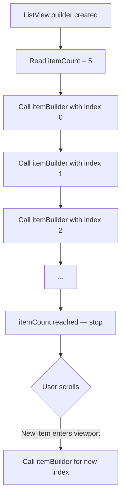
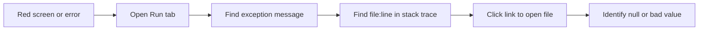
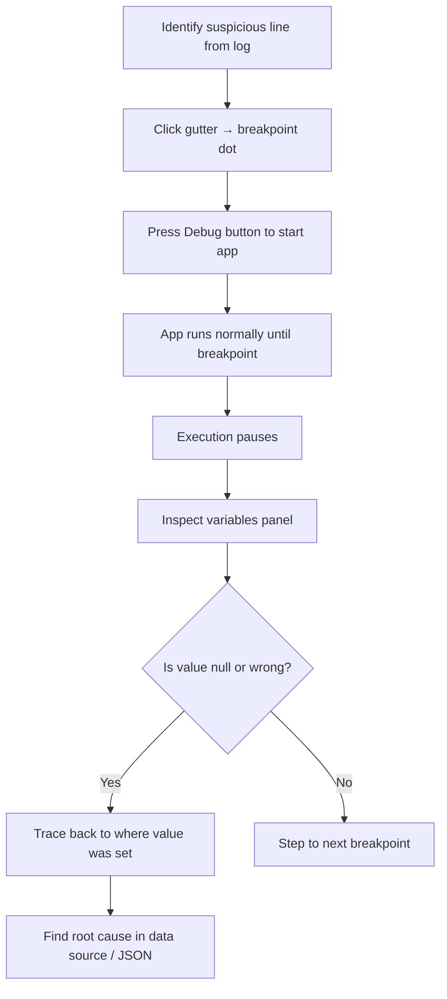
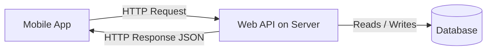
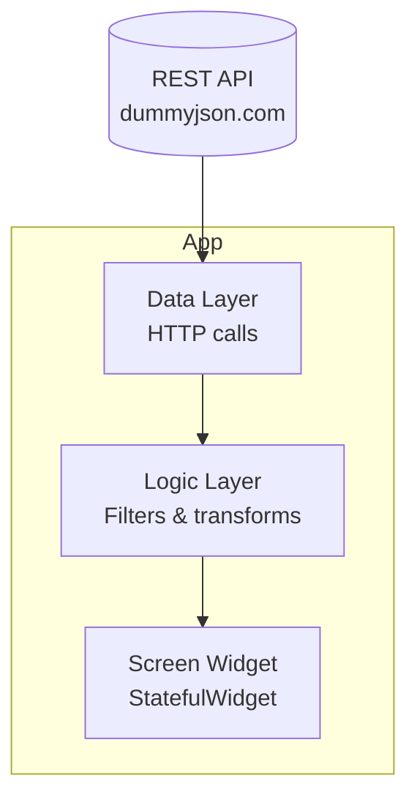
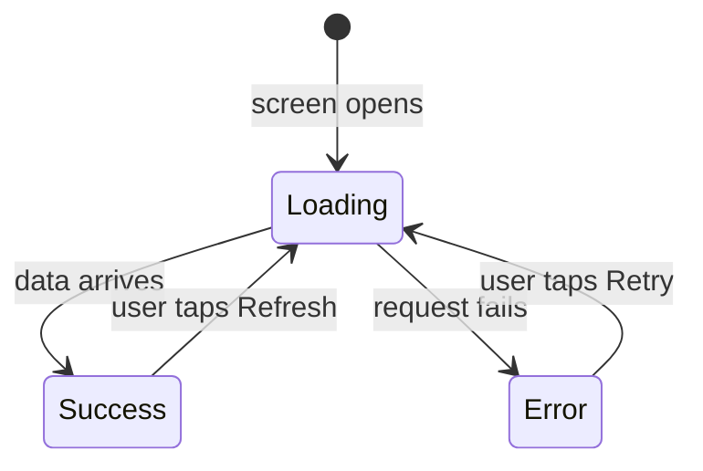

# Lab 07: ListView.builder, Debugging, and Web Services & APIs

## Overview

This lab covers four interconnected Flutter topics that take you from efficient list rendering to network-connected applications. You will learn how to build performant dynamic lists with `ListView.builder` and its `itemBuilder` callback, how to diagnose and fix runtime errors in Flutter using breakpoints and the debugger, and how to consume REST APIs over HTTP — understanding both what a web service is and how to connect to one from a Dart/Flutter app using the `http` package.

---

## Objectives

By the end of this lab you will be able to:

- Explain the difference between `ListView` (static children list) and `ListView.builder` (lazy, index-driven)
- Use the `itemBuilder` callback correctly to build widgets by index
- Drive a `ListView.builder` from a real Dart `List` of model objects
- Read Flutter's run-time error log and identify the widget and stack frame that caused a crash
- Set breakpoints and step through code in Debug mode inside Android Studio / VS Code
- Evaluate variable values at a breakpoint to pinpoint a null-value bug
- Define what a Web Service and an API are, and distinguish between the two terms
- Explain the HTTP request/response cycle and the role of an HTTP client
- Use the `http` Dart package to fetch JSON data from a REST endpoint
- Parse a JSON response into typed Dart model objects with `fromJson`
- Manage three UI states (loading, error, success) inside a `StatefulWidget`

---

## Prerequisites

- Flutter project setup and widget knowledge (Labs 01–06)
- Familiarity with `StatefulWidget`, `setState()`, and `ListView` basics
- Basic Dart class, list, and async/await syntax

---

## Background

### 1. ListView.builder — Lazy, Index-Driven Lists

#### Why ListView.builder?

The plain `ListView(children: [...])` constructor builds **all** widgets up front, even those off screen. For large or dynamic data sets this wastes memory and is slow.

`ListView.builder` builds only the widgets **currently visible** on screen. When the user scrolls, Flutter calls `itemBuilder` on demand for each new item that comes into view.

#### Constructor Signature

```dart
ListView.builder(
  itemCount: courses.length,      // total number of items
  itemBuilder: (BuildContext context, int index) {
    return CourseCard(course: courses[index]);
  },
)
```

| Parameter | Type | Description |
|-----------|------|-------------|
| `itemCount` | `int` | How many items the list contains |
| `itemBuilder` | `Widget Function(BuildContext, int)` | Called once per visible item; receives the zero-based `index` |

#### How Flutter Calls itemBuilder

When Flutter builds the list for the first time it:

1. Reads `itemCount` (e.g. 5).
2. Calls `itemBuilder(context, 0)` — renders item 0.
3. Calls `itemBuilder(context, 1)` — renders item 1.
4. Continues up to `itemCount - 1`.
5. As the user scrolls, calls `itemBuilder` for newly visible items.



#### Always Tie itemCount to the List Length

```dart
// BAD: hard-coded count goes out of sync when the list changes
ListView.builder(
  itemCount: 5,          // crashes if courses has only 3 items
  itemBuilder: (context, index) => CourseCard(course: courses[index]),
)

// GOOD: always matches the actual data
ListView.builder(
  itemCount: courses.length,
  itemBuilder: (context, index) => CourseCard(course: courses[index]),
)
```

If you write `itemCount: 5` but the backing list has only 2 elements, Flutter throws `RangeError (index): Invalid value: Not in inclusive range 0..1: 2` — the classic index-out-of-range crash.

#### Dynamic List Example

```dart
final List<String> courseNames = ['Intro to Dart', 'Flutter Basics', 'State Management'];

ListView.builder(
  itemCount: courseNames.length,
  itemBuilder: (BuildContext context, int index) {
    return ListTile(
      leading: CircleAvatar(child: Text('${index + 1}')),
      title: Text(courseNames[index]),
    );
  },
)
```

Add another item to `courseNames` and the list automatically shows it — no code change needed in `ListView.builder`.

#### Extracting a Widget Class for Each Row

The recommended pattern is to extract the row into its own `StatelessWidget`:

```dart
// course_card.dart
class CourseCard extends StatelessWidget {
  final String name;
  const CourseCard({super.key, required this.name});

  @override
  Widget build(BuildContext context) {
    return Card(
      child: ListTile(title: Text(name)),
    );
  }
}

// courses_screen.dart
ListView.builder(
  itemCount: courseNames.length,
  itemBuilder: (context, index) => CourseCard(name: courseNames[index]),
)
```

This is better than an inline `return Card(...)` because:
- The card can be independently tested
- It has its own rebuild lifecycle (only rebuilds when its own state changes)
- It is reusable across multiple screens

#### ListView with a List of Model Objects

In real apps items are model objects, not raw strings:

```dart
class Course {
  final String name;
  final String imageUrl;
  Course({required this.name, required this.imageUrl});
}

final List<Course> courses = [
  Course(name: 'Flutter Basics', imageUrl: 'https://example.com/flutter.png'),
  Course(name: 'Dart Deep Dive', imageUrl: 'https://example.com/dart.png'),
];

ListView.builder(
  itemCount: courses.length,
  itemBuilder: (context, index) {
    final course = courses[index];
    return Row(
      children: [
        Image.network(course.imageUrl, width: 60, height: 60),
        const SizedBox(width: 12),
        Text(course.name),
      ],
    );
  },
)
```

Having a single `List<Course>` instead of two parallel lists (`List<String> names` + `List<String> urls`) ensures data stays in sync automatically.

---

### 2. Flutter Debugging

#### Reading the Error Log (Run Mode)

When the app crashes with a red screen, the first step is to read the **Run** tab log — not to guess. The log shows:

1. The **exception message** — e.g. `The method was called on null`.
2. The **widget name** that caused it.
3. The **stack trace** — a list of file names and line numbers from the innermost call outward.

Click on a file name in the stack trace to jump directly to that line in the editor.



Common error patterns:

| Error text | Likely cause |
|------------|-------------|
| `The method was called on null` | A variable is `null` before a method/getter is called on it |
| `RangeError: Invalid value ... index` | `itemCount` is larger than the list length |
| `type 'Null' is not a subtype of type 'String'` | A field expected to be non-null arrived as `null` from JSON |

#### Setting a Breakpoint and Entering Debug Mode

1. Click in the **gutter** (left margin of the editor) next to the line you want to inspect. A red dot appears — this is the **breakpoint**.
2. Start the app with the **Debug** button (the bug icon), not the normal Run button.
3. Flutter runs normally until it reaches your breakpoint line, then **pauses**.
4. In the Variables panel, inspect the current values of all local variables.



#### Stepping Through Code

| Button | Action |
|--------|--------|
| Resume (▶) | Continue until the next breakpoint |
| Step Over (→) | Execute current line and move to next line |
| Step Into (↓) | Enter the method called on this line |
| Step Out (↑) | Finish current method and return to caller |

#### Finding a Null Value by Tracing Back

A common real-world scenario: the app fetches user data from an API and tries to display `user.points`, but crashes with null.

Debugging workflow:

1. Log shows `points` is null. Set breakpoint at the line that reads `points`.
2. Run in Debug mode. When paused, hover over or expand the variable in the Variables panel.
3. Confirm `points` is `null`.
4. Use **Ctrl+Click** or **Find Usages** to locate where `points` is assigned.
5. Set a breakpoint there. Resume. When paused, inspect the JSON map.
6. Evaluate the raw API response — if `points` is not in the JSON, the API is returning incomplete data.
7. Conclusion: the bug is in the **API response**, not the Dart code. Contact the backend developer.

This is a pattern that mirrors real-world professional debugging: the error is in the data layer (API), discovered through methodical breakpoint tracing.

---

### 3. Web Services and APIs — Concepts

#### What is an API?

**API** stands for **Application Programming Interface**. It is an interface that allows one program to communicate with another program programmatically (via code, not a graphical UI).

```
GUI  → human interacts with software using buttons and menus
API  → software interacts with software using code
```

#### What is a Web Service?

A **Web Service** is software that exists on the web and is made available as a service for other systems to use. All web services are APIs, but not all APIs are web services — an API can exist between two local programs with no network involved.

In practice, "API" and "web service" are used interchangeably in industry. The technical distinction is:

| | Web Service | API |
|-|-------------|-----|
| Must be on the web | Yes | No |
| Has a standard (REST, SOAP) | Yes | Not required |
| Data format | Usually JSON or XML | Any |

#### Why Do Companies Build APIs?

1. **Monetisation** — companies like Twilio (SMS), SendGrid (email), and Amazon sell API access.
2. **Data sharing** — Facebook, Twitter, and Google Maps expose APIs so third-party apps can read or post data.
3. **Internal integration** — a mobile app needs a database on a server; the API is the bridge.

#### Real-World Use Cases



**Use Case 1 — Third-party service:** A company provides a paid service (e.g. sending SMS). Developers call their API to trigger SMS from their own apps.

**Use Case 2 — App's own backend:** A quiz app needs scores stored on a server so users can see a leaderboard. The mobile app calls the company's own API which reads/writes to the server database.

#### The HTTP Protocol

Web services communicate using the **HTTP** (or HTTPS) protocol. HTTP is a set of rules that govern communication between a client and a server.

- **Client** — the program making a request (a mobile app, a browser, Postman)
- **Server** — the computer hosting the data or service

```
Client                        Server
  |                              |
  |--- HTTP Request ----------->|
  |                              | (processes request)
  |<-- HTTP Response -----------|
  |                              |
```

**HTTPS** is HTTP with encryption: the data transferred between client and server is encrypted, so anyone intercepting the traffic sees only ciphertext.

#### HTTP Client

An **HTTP client** is software or a library that allows you to send HTTP requests and receive responses. Examples:

| Category | Examples |
|----------|---------|
| Standalone programs | Chrome, Firefox, Postman |
| Library inside a language | `http` package (Dart/Flutter), `requests` (Python), `HttpClient` (Java) |

In Flutter, the `http` package provides the HTTP client you need to talk to a web service.

---

### 4. Consuming a REST API in Flutter

#### Add the http Package

```yaml
# pubspec.yaml
dependencies:
  flutter:
    sdk: flutter
  http: ^1.2.0
```

Run `flutter pub get` after saving.

#### Making a GET Request

```dart
import 'package:http/http.dart' as http;
import 'dart:convert';

Future<void> fetchData() async {
  final response = await http.get(
    Uri.parse('https://dummyjson.com/posts'),
  );

  if (response.statusCode == 200) {
    final Map<String, dynamic> decoded = json.decode(response.body) as Map<String, dynamic>;
    final List<dynamic> data = decoded['posts'] as List<dynamic>;
    // parse data...
  } else {
    throw Exception('Request failed: ${response.statusCode}');
  }
}
```

`http.get()` is asynchronous — it returns a `Future<Response>`. Always `await` it.

#### The Three-Layer Architecture with a Network Data Source



| Layer | File | Responsibility |
|-------|------|---------------|
| Data | `posts_data.dart` | `fetchPosts()` — calls the API, returns `List<PostModel>` |
| Logic | `posts_logic.dart` | Filters, limits, or transforms the list |
| UI | `posts_screen.dart` | Owns state, calls data layer, passes results to widgets |
| Widget | `post_card.dart` | Renders a single post row |

#### Parsing JSON into a Model

Define a model class with a `fromJson` factory:

```dart
class PostModel {
  final int id;
  final String title;
  final String body;

  const PostModel({required this.id, required this.title, required this.body});

  factory PostModel.fromJson(Map<String, dynamic> json) {
    return PostModel(
      id: json['id'] as int,
      title: json['title'] as String,
      body: json['body'] as String,
    );
  }
}
```

Then map the JSON list (note: `dummyjson.com` wraps posts in a `posts` key):

```dart
final Map<String, dynamic> decoded = json.decode(response.body) as Map<String, dynamic>;
final List<dynamic> data = decoded['posts'] as List<dynamic>;
final posts = data
    .map((item) => PostModel.fromJson(item as Map<String, dynamic>))
    .toList();
```

#### Managing Three UI States with setState

A screen that loads data from the network should handle three states:



```dart
class _PostsScreenState extends State<PostsScreen> {
  List<PostModel> _posts = [];
  bool _isLoading = false;
  String? _error;

  Future<void> _loadPosts() async {
    setState(() { _isLoading = true; _error = null; });

    try {
      final posts = await PostsData.fetchPosts();
      setState(() { _posts = posts; _isLoading = false; });
    } catch (e) {
      setState(() { _error = e.toString(); _isLoading = false; });
    }
  }

  @override
  Widget build(BuildContext context) {
    if (_isLoading) return const Center(child: CircularProgressIndicator());
    if (_error != null) return Center(child: Text('Error: $_error'));
    return ListView.builder(
      itemCount: _posts.length,
      itemBuilder: (context, index) => PostCard(post: _posts[index]),
    );
  }
}
```

Each `setState()` call triggers exactly one rebuild with the updated values.

#### Why Not Call the API Directly in build()?

`build()` can be called many times. Placing `http.get()` inside `build()` would fire a new network request on every rebuild — this wastes bandwidth and causes infinite loops. Instead, call it from `initState()` or from a user action:

```dart
@override
void initState() {
  super.initState();
  _loadPosts();   // runs once when the widget first mounts
}
```

---

## Lab Tasks

### Task 1: Build an Index-Driven List

1. Create a `List<String>` of at least 6 course names in Dart code.
2. Display them in a `ListView.builder` using a `ListTile` for each item.
3. Set `itemCount` to `courses.length` (not a literal number).
4. Add a seventh item to the list. Verify it appears automatically without changing `ListView.builder`.

**Expected output:** A scrollable list that always reflects the exact length of the backing list.

### Task 2: Extract a Widget Class for a Row

1. Extract each `ListTile` row into a `CourseCard` `StatelessWidget` that accepts a `String name` parameter.
2. In `ListView.builder`, replace the inline `ListTile` with `CourseCard(name: courses[index])`.
3. Run `flutter analyze` and fix any warnings.

**Expected output:** A `course_card.dart` file containing `CourseCard`, and a clean `courses_screen.dart`.

### Task 3: Simulate and Debug a Null Crash

1. Create a simple screen that displays a user's score from a variable `int? userScore`.
2. Intentionally leave `userScore` as `null` and call `.toString()` on it in a way that might crash (or display it via string interpolation to observe null safety).
3. Read the Run tab log and identify the offending line.
4. Set a breakpoint before that line and run in Debug mode.
5. Inspect `userScore` in the Variables panel. Confirm it is `null`.
6. Fix the issue by providing a default value: `userScore ?? 0`.

**Expected output:** The screen shows `0` instead of crashing.

### Task 4: Fetch Posts from a REST API

1. Add `http: ^1.2.0` to `pubspec.yaml` and run `flutter pub get`.
2. Create `PostModel` with fields `id`, `title`, `body` and a `fromJson` factory.
3. Create a `PostsData` class with a static `fetchPosts()` method that calls `https://dummyjson.com/posts`.
4. Create `PostsScreen` — a `StatefulWidget` with `_isLoading`, `_error`, and `_posts` state variables.
5. Call `fetchPosts()` in `initState()`.
6. Display a `CircularProgressIndicator` while loading, an error message on failure, and a `ListView.builder` on success.

**Expected output:** The screen shows a loading spinner, then a list of post titles fetched from the internet.

### Task 5: Extract PostCard and Add Error Recovery

1. Extract the list row into a `PostCard` `StatelessWidget` that accepts a `PostModel`.
2. Add a Retry button to the error state that calls `_loadPosts()` again.
3. Add a refresh icon to the `AppBar` that reloads the list on tap.
4. Run `flutter analyze` — fix all issues.

**Expected output:** Modular code with separate files for model, data, logic, screen, and widget. Zero analyzer issues.

---

## Summary

| Concept | Key takeaway |
|---------|-------------|
| `ListView.builder` | Builds only visible widgets lazily; always set `itemCount` to `list.length` |
| `itemBuilder` | A function called by Flutter per visible item; receives `context` and `index` |
| Widget class for rows | Preferred over inline builds — own lifecycle, reusable, independently testable |
| Flutter Debugger | Set breakpoints, run in Debug mode, inspect Variables panel to find null values |
| Stack trace | Points directly to the file and line that caused the crash — always read it first |
| API | Application Programming Interface — a programmatic contract between two systems |
| Web Service | An API that lives on the web and communicates over HTTP/HTTPS |
| HTTP Request/Response | Client sends a request to a server; server replies with a response and status code |
| `http` package | Dart library providing an HTTP client — use `http.get()` to fetch data |
| `fromJson` factory | Converts a raw JSON `Map` into a typed Dart model object |
| Three UI states | Loading (`CircularProgressIndicator`), Error (message + retry), Success (list) |
| `initState()` | The right place to trigger the first network call — runs once when the widget mounts |
