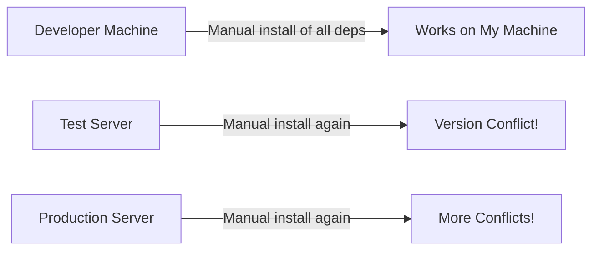
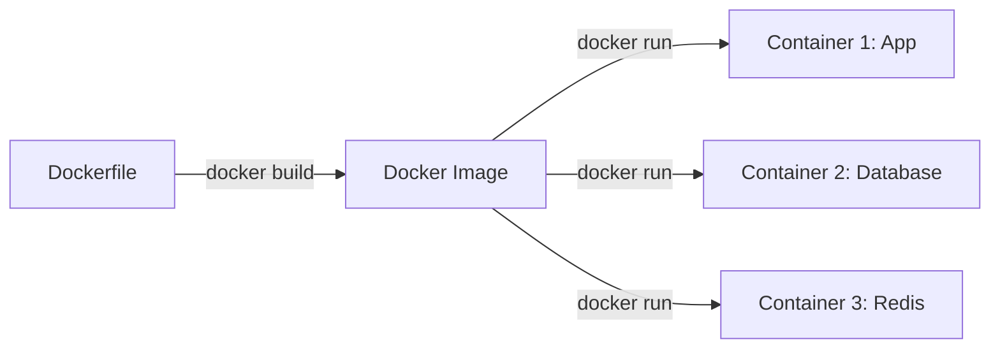
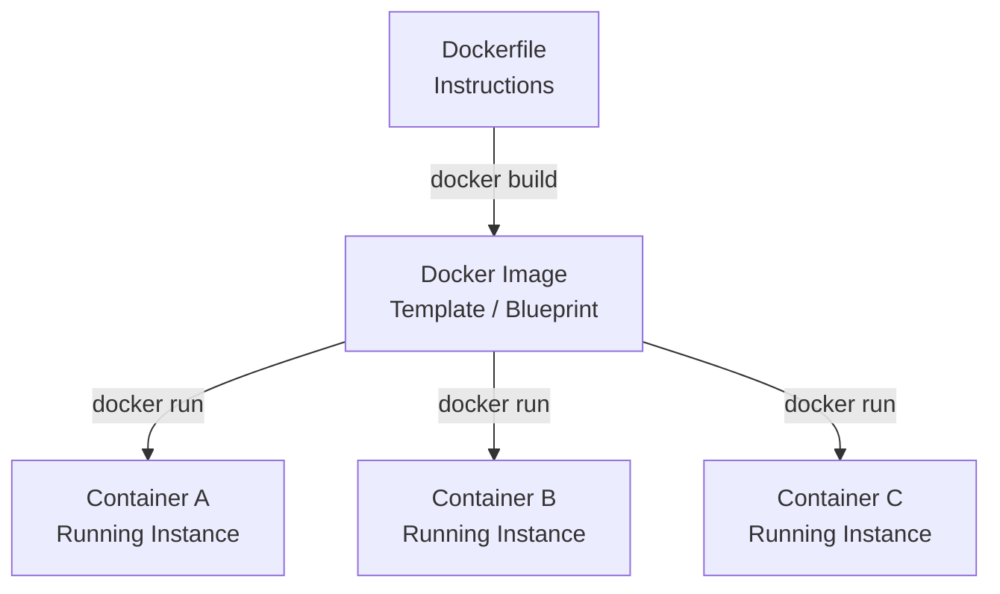
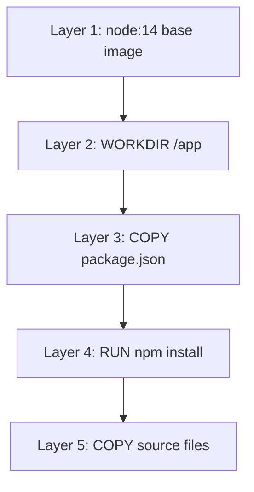

# Lab 08: Introduction to Docker — Containers and Images

## Overview

This lab introduces Docker as a containerization technology. You will learn why Docker was created, what problem it solves, how to write a Dockerfile, and how to build and run Docker images and containers. The demo application is a simple Node.js/Express server used throughout the lab to make every concept hands-on from day one.

---

## Objectives

- Understand the deployment and environment consistency problem that Docker solves
- Install and configure Docker Desktop on your local machine
- Build a simple Node.js/Express application to use as a Docker target
- Write a Dockerfile with all required instructions
- Build a Docker image from a Dockerfile
- Run, inspect, stop, and remove Docker containers
- Understand the difference between a Dockerfile, an image, and a container
- Use Docker Hub to find official base images

## Prerequisites

- A computer running Windows, macOS, or Linux
- Basic familiarity with the terminal/command line
- Node.js LTS installed (for running the demo app before Dockerizing it)
- Docker Desktop installed (see Task 1)
- Visual Studio Code (recommended, with the Docker extension)

---

## Background

### The Problem Docker Solves

When a new developer joins a project or when you need to deploy an application to a new server, the typical workflow requires manually installing every dependency the application needs. Consider a project with the following stack: PHP with Laravel, PostgreSQL with the PostGIS spatial plugin, Redis for caching, and Angular for the frontend. To get this running locally, each developer must install compatible versions of every component. Version mismatches — for example, a Laravel version requiring a specific PHP version, or PostGIS requiring a specific Postgres version — frequently produce installation errors that can take hours or days to resolve.

The same problem repeats every time the application moves to a new environment: local development, testing server, staging server, and production. Each environment requires the same setup steps, and each step is a potential failure point.



### What is Docker?

Docker is a tool that allows you to package your application along with everything it needs to run — its runtime, dependencies, configuration — into a portable unit called a **container**. You can then move that container from one environment to another with a single command, without reinstalling anything.

The Docker logo depicts a whale carrying a stack of containers on its back. This is the core metaphor: just as cargo ships transport standardized containers from port to port regardless of what is inside them, Docker transports your application containers from machine to machine regardless of the underlying operating system.



With Docker, the entire setup for a new developer becomes:

```bash
docker build -t myapp .
docker run myapp
```

That replaces days of dependency installation and debugging.

### Docker Image vs Docker Container

Docker uses a concept similar to Object-Oriented Programming:

| OOP Concept | Docker Equivalent |
|-------------|-------------------|
| Class / Blueprint | Docker Image |
| Object / Instance | Docker Container |

A **Docker Image** is a read-only template built from a Dockerfile. It contains all the layers needed to run your application. A single image can be used to create multiple containers.

A **Docker Container** is a running instance of an image. It is an isolated environment where your application actually executes.



### Docker Image Layers

Every instruction in a Dockerfile creates a layer in the resulting image. Docker caches these layers. If a layer has not changed since the last build, Docker reuses the cached version instead of rebuilding it. This makes subsequent builds faster.



### Docker Hub

Docker Hub (`hub.docker.com`) is a public registry for Docker images. It is the equivalent of GitHub for Docker images. All official base images — Node.js, PHP, Python, PostgreSQL, Redis, nginx — are stored there. Docker automatically pulls images from Docker Hub when you reference them in a Dockerfile.

Each image on Docker Hub has multiple tags representing different versions and variants:

| Tag | Description |
|-----|-------------|
| `node:14` | Full Node.js 14 image (Debian-based) |
| `node:14-alpine` | Minimal Node.js 14 image (~5 MB base, Alpine Linux) |
| `node:14-slim` | Reduced Node.js 14 image (fewer packages than full) |

---

## Lab Tasks

### Task 1: Install Prerequisites

**1.1 Install Docker Desktop**

Search for "install Docker Desktop" and navigate to `docker.com`. Install Docker Desktop for your operating system (Windows, macOS, or Linux). Docker Desktop installs Docker Engine, Docker Compose, and Docker Swarm together.

After installation, verify Docker is running by checking your system tray for the Docker icon. You can also open the Docker Desktop dashboard to monitor containers visually.

**1.2 Verify the installation**

```bash
docker --version
docker ps
```

Expected output for `docker ps`:
```
CONTAINER ID   IMAGE   COMMAND   CREATED   STATUS   PORTS   NAMES
```

An empty table means Docker is running and no containers are active yet.

**1.3 Configure Docker Desktop (optional)**

In Docker Desktop Settings → General, you can enable "Start Docker Desktop when you login" so Docker starts automatically with your machine.

---

### Task 2: Create the Node.js Demo Application

This application serves as the target for Dockerization throughout the lab.

**2.1 Create the project directory**

```bash
mkdir node-app
cd node-app
```

**2.2 Initialize the Node.js project**

```bash
npm init -y
```

This creates `package.json`. Accept all defaults.

**2.3 Install Express**

```bash
npm install express
```

**2.4 Install nodemon as a development dependency**

```bash
npm install --save-dev nodemon
```

nodemon watches for file changes and automatically restarts the server during local development.

**2.5 Create `index.js`**

```javascript
const express = require('express');
const app = express();

const PORT = 4000;

app.get('/', (req, res) => {
    res.send('<h2>Hello from Docker!</h2>');
});

app.listen(PORT, () => {
    console.log(`App is up and running on port ${PORT}`);
});
```

**2.6 Add scripts to `package.json`**

Edit the `scripts` section:

```json
"scripts": {
    "start": "node index.js",
    "start:dev": "nodemon index.js"
}
```

**2.7 Test the application without Docker**

```bash
npm start
```

Expected output:
```
App is up and running on port 4000
```

Open `http://localhost:4000` in your browser. You should see the HTML response.

Press `Ctrl+C` to stop the server before proceeding.

---

### Task 3: Write the Dockerfile

Create a file named `Dockerfile` (no extension) in the root of `node-app`.

> Install the Docker extension in VS Code for syntax highlighting and autocompletion in Dockerfiles.

**Complete Dockerfile:**

```dockerfile
FROM node:14

WORKDIR /app

COPY package.json .

RUN npm install

COPY . .

EXPOSE 4000

CMD ["npm", "start"]
```

**Explanation of each instruction:**

| Instruction | Purpose |
|-------------|---------|
| `FROM node:14` | Sets the base image. Docker pulls Node.js 14 from Docker Hub. This installs Node and npm inside the container. |
| `WORKDIR /app` | Creates and sets `/app` as the working directory inside the container. All subsequent commands run from this path. |
| `COPY package.json .` | Copies only `package.json` into the container's working directory before running `npm install`. |
| `RUN npm install` | Installs all dependencies listed in `package.json` into `/app/node_modules` inside the container. |
| `COPY . .` | Copies all remaining application source files into the container's working directory. |
| `EXPOSE 4000` | Documents that the application listens on port 4000. This is metadata — it does not publish the port to the host machine. |
| `CMD ["npm", "start"]` | The command Docker runs when a container starts. Runs the `start` script defined in `package.json`. |

**Why copy `package.json` separately before copying the full source?**

Docker caches each layer. If you copy `package.json` first and run `npm install` as a separate layer, Docker only re-runs `npm install` when `package.json` actually changes. If you change only your source code (`index.js`, etc.), Docker reuses the cached `npm install` layer, making rebuilds much faster.

---

### Task 4: Build the Docker Image

```bash
docker build -t express-node-app .
```

- `-t express-node-app` names the image `express-node-app`
- `.` tells Docker to look for a `Dockerfile` in the current directory

**Expected output (abbreviated):**

```
[1/5] FROM node:14
[2/5] WORKDIR /app
[3/5] COPY package.json .
[4/5] RUN npm install
[5/5] COPY . .
Successfully built <image-id>
Successfully tagged express-node-app:latest
```

Docker pulls the `node:14` base image from Docker Hub on the first run. Subsequent builds use the cached base layer.

**Verify the image was created:**

```bash
docker image ls
```

Expected output:

```
REPOSITORY          TAG       IMAGE ID       CREATED         SIZE
express-node-app    latest    <id>           X seconds ago   960MB
```

---

### Task 5: Run a Docker Container

**5.1 Run in the foreground (for initial testing)**

```bash
docker run --name express-node-app-container express-node-app
```

Expected output:
```
App is up and running on port 4000
```

The terminal is now attached to the container. Press `Ctrl+C` to stop it.

**5.2 Run in detached mode with port forwarding**

```bash
docker run -d --name express-node-app-container -p 4000:4000 express-node-app
```

| Flag | Meaning |
|------|---------|
| `-d` | Detached mode — runs in the background, returns control to your terminal |
| `--name express-node-app-container` | Assigns a human-readable name to the container |
| `-p 4000:4000` | Port forwarding: maps port 4000 on your host machine to port 4000 inside the container |

**Why is port forwarding required?**

Containers run in an isolated network environment. Even though the application inside listens on port 4000, and even though `EXPOSE 4000` is declared in the Dockerfile, the port is not accessible from your host machine until you explicitly forward it with `-p`. The format is `-p <host_port>:<container_port>`.

**5.3 Verify the container is running**

```bash
docker ps
```

Expected output:

```
CONTAINER ID   IMAGE              COMMAND        CREATED        STATUS        PORTS                    NAMES
<id>           express-node-app   "npm start"    5 seconds ago  Up 4 seconds  0.0.0.0:4000->4000/tcp   express-node-app-container
```

**5.4 Test in the browser**

Open `http://localhost:4000`. You should see the HTML response from inside the container.

---

### Task 6: Manage Containers and Images

**List running containers:**

```bash
docker ps
```

**List all containers (including stopped ones):**

```bash
docker ps -a
```

**Stop a running container:**

```bash
docker stop express-node-app-container
```

**Remove a stopped container:**

```bash
docker rm express-node-app-container
```

**Force-stop and remove a running container in one command:**

```bash
docker rm -f express-node-app-container
```

**List all images:**

```bash
docker image ls
```

**Remove an image:**

```bash
docker rmi express-node-app
```

> You cannot remove an image while a container (even a stopped one) is using it. Remove the container first.

**View container logs:**

```bash
docker logs express-node-app-container
```

**Summary of essential commands:**

| Command | Action |
|---------|--------|
| `docker build -t <name> .` | Build an image from the Dockerfile in the current directory |
| `docker image ls` | List all local images |
| `docker run -d -p <host>:<container> --name <name> <image>` | Run a container in the background with port forwarding |
| `docker ps` | List running containers |
| `docker ps -a` | List all containers |
| `docker stop <name>` | Stop a running container |
| `docker rm <name>` | Remove a stopped container |
| `docker rm -f <name>` | Force remove a running container |
| `docker rmi <image>` | Remove an image |
| `docker logs <name>` | View container output logs |

---

### Task 7: Explore Docker Hub

**7.1 Browse to Docker Hub**

Open `https://hub.docker.com` and search for `node`.

**7.2 Read the official Node.js image page**

The first result with the official badge is the Docker-maintained Node.js image. Scroll down to see all available tags. Notice the different variants: full image, `slim`, `alpine`. Alpine-based images are significantly smaller because they are built on Alpine Linux (~5 MB base).

**7.3 Choose the right base image**

For production use cases where image size matters, prefer:

```dockerfile
FROM node:14-alpine
```

For development or when you need full system tools, the full image is acceptable.

**7.4 Try a different base image variant**

Change your Dockerfile's first line to:

```dockerfile
FROM node:14-alpine
```

Rebuild and compare the image size:

```bash
docker build -t express-node-app-alpine .
docker image ls
```

The Alpine-based image should be significantly smaller than the full `node:14` image.

---

## Summary

| Concept | Key Takeaway |
|---------|--------------|
| The Problem | Moving an application between environments requires reinstalling all dependencies every time, which is error-prone and time-consuming |
| Docker | A tool that packages your application and its dependencies into portable containers that run consistently anywhere |
| Docker Hub | A public registry at `hub.docker.com` where official and community Docker images are stored |
| Dockerfile | A text file with step-by-step instructions telling Docker how to build an image for your application |
| `FROM` | Specifies the base image — the starting point that provides the runtime (e.g., Node.js, PHP, Python) |
| `WORKDIR` | Sets the working directory inside the container |
| `COPY` | Copies files from your local machine into the container's filesystem |
| `RUN` | Executes a command during the image build step (e.g., `npm install`) |
| `CMD` | The command that runs when a container starts (e.g., `npm start`) |
| `EXPOSE` | Documents which port the application listens on (does not publish the port) |
| Docker Image | The built template (blueprint/class) produced by `docker build` |
| Image Layers | Each Dockerfile instruction creates a cached layer; unchanged layers are reused on rebuilds |
| Docker Container | A running instance of an image (like an object instantiated from a class) |
| Port Forwarding (`-p`) | Maps a host port to a container port so the application is accessible from outside the container |
| `-d` flag | Runs the container in detached (background) mode |
| Caching optimization | Copy `package.json` and run `npm install` before copying source files to avoid reinstalling dependencies on every code change |
