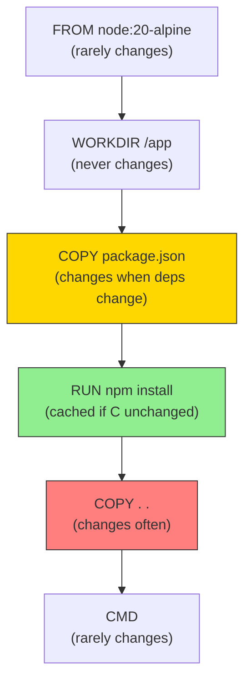
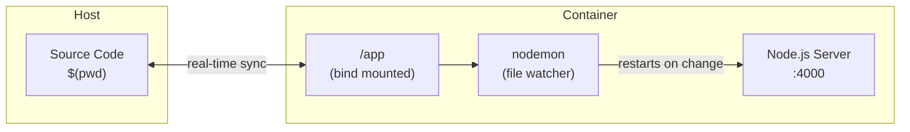
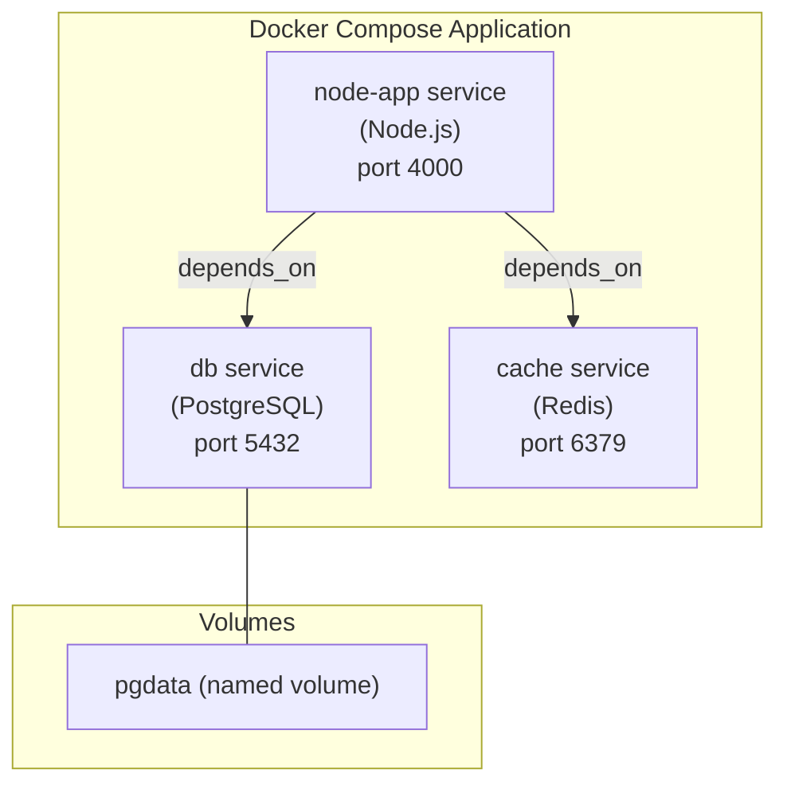

# Lab 09: Docker Advanced — Optimization, Volumes, Compose & Environment Variables

## Overview

This lab covers advanced Docker concepts demonstrated through a Node.js/Express application. Topics include Dockerfile optimization, hot reload in development using volume bind mounts, Docker Volumes (bind mounts vs anonymous volumes), Docker Compose for multi-container orchestration, and environment variable management.

## Learning Objectives

By the end of this lab, you will be able to:

- Optimize Docker images using `.dockerignore` and layer caching techniques
- Use bind mounts to enable hot reload during development
- Distinguish between bind mounts and anonymous volumes and know when to use each
- Define multi-container applications using Docker Compose
- Manage environment variables in Docker containers and Compose files
- Use `docker exec` to open interactive terminals inside running containers

---

## Key Concepts

### Image Optimization

#### The `.dockerignore` File

Just like `.gitignore` tells Git which files to ignore, `.dockerignore` tells Docker which files to exclude from the build context. This reduces the size of what gets sent to the Docker daemon and prevents sensitive files from leaking into images.

**Common files to exclude and why:**

| File / Folder | Reason to Exclude |
|---|---|
| `node_modules/` | Re-installed inside the container by `npm install`. Copying it wastes time and may include wrong-platform binaries. |
| `Dockerfile` | Already used to create the container — no reason to have it inside. |
| `.env` | Contains secrets that should not be baked into the image. |
| `.git/` | Version control metadata — not needed at runtime. |
| `*.log` | Log files are ephemeral and large. |

**Example `.dockerignore`:**
```
node_modules
Dockerfile
.dockerignore
.env
.git
*.log
dist
build
coverage
.DS_Store
```

> Without `.dockerignore`, a `COPY . .` instruction in your Dockerfile copies your entire `node_modules` folder (potentially hundreds of MB) into the image — even though `npm install` will regenerate it anyway.

#### Layer Caching

Docker builds images in layers. Each instruction in a `Dockerfile` creates a new layer. Docker **caches** layers and reuses them if the instruction and all preceding layers haven't changed.

**Strategy: Copy dependency files BEFORE source code.**

```dockerfile
# Bad: copying everything first invalidates cache on every code change
FROM node:20-alpine
WORKDIR /app
COPY . .                  # ← any file change busts ALL subsequent layers
RUN npm install
CMD ["node", "server.js"]
```

```dockerfile
# Good: copy package files first so npm install is cached
FROM node:20-alpine
WORKDIR /app
COPY package.json package-lock.json ./   # ← only changes when deps change
RUN npm install                           # ← cached unless deps change
COPY . .                                  # ← source code changes don't bust npm install
CMD ["node", "server.js"]
```

**Layer Caching Rules:**
- Layers are cached from top to bottom
- Once one layer is invalidated, all layers below it are rebuilt
- Put slow, infrequently-changing steps (like `RUN npm install`) near the top
- Put frequently-changing steps (like `COPY . .`) near the bottom



---

### Docker Volumes & Hot Reload

#### The Problem with Containers During Development

When you run a container from an image, the container has a **snapshot** of your code at build time. If you edit a file on your host machine, the container does not see the change — you would have to rebuild the image every time. This is not practical during active development.

#### Inspecting a Running Container

Before working with volumes, you need to know how to examine what is happening inside a container:

```bash
# Open an interactive bash terminal inside a running container
docker exec -it <container_name> bash

# Inside the container: list files in current directory
ls

# Inside the container: print working directory
pwd

# Inside the container: display contents of a file
cat index.js

# View container logs (useful to verify nodemon is running)
docker logs <container_name>
```

The `-it` flag means **interactive terminal** — it opens a live shell session inside the container.

#### Making Hot Reload Work: nodemon

By default, a Node.js app started with `node index.js` does not restart when files change. Use `nodemon` to watch for changes and restart the server automatically:

```json
// package.json
{
  "scripts": {
    "start": "node index.js",
    "start:dev": "nodemon index.js"
  },
  "devDependencies": {
    "nodemon": "^3.0.0"
  }
}
```

Update the Dockerfile CMD to use the dev script:

```dockerfile
FROM node:18-alpine
WORKDIR /app
COPY package.json .
RUN npm install
COPY . .
CMD ["npm", "run", "start:dev"]
```

#### Bind Mounts

A **bind mount** links a directory on your host machine directly into the container. Changes on the host are immediately visible inside the container — no image rebuild needed.

```bash
# -v flag: bind mount current directory into /app inside the container
# $(pwd) resolves to your absolute path (required — relative paths do NOT work)
docker run -d \
  --name express-node-app-container \
  -p 4000:4000 \
  -v $(pwd):/app \
  my-express-app
```

**On Windows**, use `%cd%` instead of `$(pwd)`.

**Hot Reload Architecture:**



#### Read-Only Bind Mount (Recommended for Development)

The default bind mount is **two-way**: changes on the host appear in the container, and changes **inside the container** also appear on the host. This is a security risk — a process inside the container could delete your files.

Add `:ro` (read-only) to prevent the container from writing back to the host:

```bash
docker run -d \
  --name express-node-app-container \
  -p 4000:4000 \
  -v $(pwd):/app:ro \
  my-express-app
```

Now if something inside the container tries to create or delete files:

```bash
# Inside the container:
touch newfile.js
# Error: touch: newfile.js: Read-only file system
```

#### Anonymous Volumes: Protecting `node_modules`

**The problem with read-only bind mounts:** If you delete `node_modules` on your host (or if it does not exist there), the container also loses it — crashing the application. This happens because the bind mount mirrors both directories.

**The solution: anonymous volume**

A second `-v` flag with only a container path (no host path) creates an anonymous volume. Docker manages this volume independently of the bind mount. It protects that directory from being overwritten:

```bash
docker run -d \
  --name express-node-app-container \
  -p 4000:4000 \
  -v $(pwd):/app:ro \
  -v /app/node_modules \
  my-express-app
```

The `-v /app/node_modules` tells Docker: "keep `/app/node_modules` in its own volume — do not let the host bind mount touch it."

**Volume Types Summary:**

| Type | Syntax | Description | Use Case |
|---|---|---|---|
| Bind Mount | `-v /host/path:/container/path` | Two-way sync between host and container | Hot reload during development |
| Read-Only Bind Mount | `-v /host/path:/container/path:ro` | One-way: host changes reach container, not vice versa | Source code sync (recommended) |
| Anonymous Volume | `-v /container/path` | Docker-managed, no host path | Protect `node_modules`, temp data |
| Named Volume | `-v myvolume:/container/path` | Docker-managed with a name | Database data persistence |

```bash
# List all volumes
docker volume ls

# Inspect a volume
docker volume inspect <volume_name>

# Remove a volume
docker volume rm <volume_name>

# Create a named volume explicitly
docker volume create mydata
```

#### Selective Bind Mount: Only the Source Folder

A cleaner approach is to bind mount only the folder that contains your application source (e.g., `./src`), not the entire project root. This keeps `node_modules` naturally outside the mount:

```bash
docker run -d \
  --name express-node-app-container \
  -p 4000:4000 \
  -v $(pwd)/src:/app/src:ro \
  my-express-app
```

This is the cleanest solution: no anonymous volume needed, no risk of overwriting `node_modules`.

---

### Docker Compose

Docker Compose is a utility that ships with Docker (but has its own version number) that lets you define and run containers using a YAML configuration file. Instead of running long `docker build` and `docker run` commands every time, you write the configuration once and use simple commands.

**Check versions:**

```bash
docker version
docker compose version
```

#### Why Compose?

Without Compose, running a containerized application requires:

```bash
# Step 1: build
docker build -t my-express-app .

# Step 2: run (long command, error-prone to retype every time)
docker run -d \
  --name express-node-app-container \
  -p 4000:4000 \
  -v $(pwd)/src:/app/src:ro \
  -v /app/node_modules \
  my-express-app
```

With Compose, this becomes two steps — once:

```bash
docker compose up -d
```

Compose becomes even more essential when you have multiple containers (application + database + cache + reverse proxy) that need to communicate.

#### `docker-compose.yml` Structure

The `docker-compose.yml` file lives in the project root alongside the `Dockerfile`.

```yaml
version: "3"

services:
  node-app:
    container_name: express-node-app-container
    build: .
    ports:
      - "4000:4000"
    volumes:
      - ./src:/app/src:ro
      - /app/node_modules
```

**Key fields:**

| Field | Equivalent `docker run` option | Description |
|---|---|---|
| `container_name` | `--name` | Name for the container |
| `build: .` | (runs `docker build` first) | Path to Dockerfile; `.` = current directory |
| `ports` | `-p host:container` | Port mapping |
| `volumes` | `-v` | Volume mounts (bind or anonymous) |
| `environment` | `--env` | Inline environment variables |
| `env_file` | `--env-file` | Load variables from a file |
| `depends_on` | (no equivalent) | Start order dependency |

**Note on volumes in Compose:** Unlike the `docker run` `-v` flag (which requires absolute paths), Compose supports **relative paths**. `./src` works fine in Compose and resolves to the current directory automatically.

**Note on YAML indentation:** YAML is indentation-sensitive. Each child key must be indented consistently (2 spaces is standard). Incorrect indentation causes parsing errors.

#### Architecture Example (Multi-Container)



**All services in the same `docker-compose.yml` can reach each other using the service name as the hostname.** Docker Compose creates an internal network automatically.

#### Essential Docker Compose Commands

```bash
# Start all services — builds image if needed, then runs containers
docker compose up

# Start in detached mode (background, terminal freed)
docker compose up -d

# Start and force rebuild images
docker compose up -d --build

# Stop and remove all containers defined in the file
docker compose down

# Stop and remove containers AND volumes
docker compose down -v

# View logs for all services
docker compose logs

# Follow logs for a specific service
docker compose logs -f node-app

# List running services
docker compose ps

# Open a shell inside a running service
docker compose exec node-app bash

# Rebuild a specific service without cache
docker compose build --no-cache node-app

# Show available commands
docker compose --help
```

**How Compose names the image it builds:**

If the folder containing `docker-compose.yml` is named `my-express-app` and the service is named `node-app`, the image will be named `my-express-app_node-app`. Compose derives the image name from the project directory and service name automatically.

#### Full Example: App + Database

```yaml
version: "3"

services:
  node-app:
    container_name: express-node-app-container
    build: .
    ports:
      - "4000:4000"
    volumes:
      - ./src:/app/src:ro
      - /app/node_modules
    env_file:
      - .env
    depends_on:
      - db

  db:
    image: postgres:15-alpine
    ports:
      - "5432:5432"
    environment:
      POSTGRES_USER: devuser
      POSTGRES_PASSWORD: devpassword
      POSTGRES_DB: myappdb
    volumes:
      - pgdata:/var/lib/postgresql/data

volumes:
  pgdata:
```

---

### Environment Variables

Environment variables let you configure application behavior without hardcoding values in the image. This is essential for:

- Switching between development, staging, and production
- Keeping database credentials and secrets out of the codebase
- Making containers portable and configurable at runtime

#### Method 1: ENV in Dockerfile

```dockerfile
FROM node:18-alpine
WORKDIR /app
ENV PORT=4000
ENV NODE_ENV=production
COPY package.json .
RUN npm install
COPY . .
CMD ["npm", "start"]
```

The application accesses these via `process.env.PORT`.

#### Method 2: `--env` flag with `docker run`

```bash
docker run -d \
  --name my-node-app-container \
  -p 4000:4000 \
  --env PORT=4000 \
  --env NODE_ENV=development \
  my-express-app
```

Short form: `-e PORT=4000`

**Verify environment variables inside a running container:**

```bash
docker exec -it my-node-app-container bash

# List all environment variables
printenv

# Get a specific variable
printenv PORT
# Output: 4000

printenv NODE_ENV
# Output: development
```

#### Method 3: `--env-file` flag

For multiple variables, store them in a `.env` file:

```bash
# .env
PORT=4000
NODE_ENV=development
DB_HOST=localhost
DB_PASSWORD=secret
```

Pass the whole file:

```bash
docker run -d \
  --name my-node-app-container \
  -p 4000:4000 \
  --env-file .env \
  my-express-app
```

#### Method 4: `environment` in `docker-compose.yml` (Inline)

```yaml
services:
  node-app:
    build: .
    ports:
      - "4000:4000"
    environment:
      - PORT=4000
      - NODE_ENV=production
```

#### Method 5: `env_file` in `docker-compose.yml` (Recommended)

```yaml
services:
  node-app:
    build: .
    ports:
      - "4000:4000"
    env_file:
      - .env
```

This is the recommended approach for secrets — the `.env` file is loaded at runtime but is not baked into the image.

**`.env` file:**
```
PORT=4000
NODE_ENV=development
DB_HOST=localhost
DB_PASSWORD=secret
```

#### `.env` Security

Always add `.env` to both `.gitignore` and `.dockerignore`:

```
# .gitignore and .dockerignore
.env
.env.local
.env.production
```

Provide a `.env.example` for teammates:

```
PORT=4000
NODE_ENV=development
DB_HOST=localhost
DB_PASSWORD=your-password-here
```

#### Variable Substitution in `docker-compose.yml`

```yaml
services:
  db:
    image: postgres:15
    environment:
      POSTGRES_PASSWORD: ${DB_PASSWORD}
      POSTGRES_USER: ${DB_USER:-defaultuser}    # default value if variable not set
```

Docker Compose automatically reads the `.env` file in the same directory — no `--env-file` flag needed.

#### Accessing Environment Variables in Node.js

```javascript
const port = process.env.PORT || 4000;
const dbUrl = process.env.DATABASE_URL;
const nodeEnv = process.env.NODE_ENV;

app.listen(port, () => {
  console.log(`Server running on port ${port} in ${nodeEnv} mode`);
});
```

---

## Practical Examples

### Full Development Setup with Docker Compose

**Project structure:**
```
my-app/
├── .dockerignore
├── .env
├── .env.example
├── .gitignore
├── docker-compose.yml
├── docker-compose.prod.yml
├── Dockerfile
├── Dockerfile.dev
├── package.json
├── package-lock.json
└── src/
    └── server.js
```

**`Dockerfile` (production):**
```dockerfile
FROM node:20-alpine AS deps
WORKDIR /app
COPY package.json package-lock.json ./
RUN npm ci --only=production

FROM node:20-alpine AS runner
WORKDIR /app
COPY --from=deps /app/node_modules ./node_modules
COPY . .
EXPOSE 3000
CMD ["node", "src/server.js"]
```

**`Dockerfile.dev` (development):**
```dockerfile
FROM node:20-alpine
WORKDIR /app
COPY package.json package-lock.json ./
RUN npm install
EXPOSE 3000
CMD ["npx", "nodemon", "src/server.js"]
```

**`docker-compose.yml` (development):**
```yaml
version: "3.9"

services:
  app:
    build:
      context: .
      dockerfile: Dockerfile.dev
    ports:
      - "3000:3000"
    volumes:
      - .:/app
      - /app/node_modules
    env_file:
      - .env
    depends_on:
      - db

  db:
    image: postgres:15-alpine
    ports:
      - "5432:5432"
    env_file:
      - .env
    volumes:
      - pgdata:/var/lib/postgresql/data

volumes:
  pgdata:
```

**`.dockerignore`:**
```
node_modules
.env
.git
.gitignore
*.log
npm-debug.log*
.DS_Store
coverage
dist
```

**`.env`:**
```
NODE_ENV=development
PORT=3000
POSTGRES_USER=devuser
POSTGRES_PASSWORD=devpassword
POSTGRES_DB=myappdb
DATABASE_URL=postgres://devuser:devpassword@db:5432/myappdb
```

### Volume Mounting for Development

```bash
# Start dev environment with hot reload
docker compose up -d

# Edit any file in src/ → nodemon detects change → server restarts
# No rebuild needed

# When you add a new package:
docker compose down
# add package to package.json
docker compose up -d --build   # rebuild to run npm install
```

### Using `.env` with Docker

```bash
# Docker Compose automatically reads .env in the same directory
docker compose up -d

# Override with a different env file
docker compose --env-file .env.staging up -d

# Pass a single variable override
DATABASE_URL=postgres://prod@prodhost/db docker compose up -d
```

---

## Lab Tasks

### Task 1: Optimize a Dockerfile with `.dockerignore` and Layer Caching

**Given this inefficient Dockerfile:**

```dockerfile
FROM node:18-alpine
WORKDIR /app
COPY . .
RUN npm install
CMD ["node", "index.js"]
```

**Steps:**

1. Rewrite the Dockerfile to copy `package.json` first, then run `npm install`, then copy the rest:

   ```dockerfile
   FROM node:18-alpine
   WORKDIR /app
   COPY package.json .
   RUN npm install
   COPY . .
   CMD ["node", "index.js"]
   ```

2. Create `.dockerignore`:

   ```
   node_modules
   Dockerfile
   .dockerignore
   .env
   ```

3. Build the image:

   ```bash
   docker build -t my-express-app .
   ```

4. Build again without changing anything — observe all steps show `CACHED`.

5. Change a line in `index.js`, rebuild. Confirm `npm install` is still `CACHED` (only the `COPY . .` step reruns).

6. Change `package.json` (add a space), rebuild. Confirm `npm install` now **reruns** (cache invalidated).

7. Run the container and verify it works:

   ```bash
   docker run -d --name express-node-app-container -p 4000:4000 my-express-app
   curl http://localhost:4000
   ```

8. Open a shell inside and verify `Dockerfile` is not present:

   ```bash
   docker exec -it express-node-app-container bash
   ls
   # Dockerfile should NOT appear
   ```

---

### Task 2: Hot Reload with Volume Bind Mounts

**Goal:** Edit source files and see changes without rebuilding the image.

**Steps:**

1. Add `nodemon` to your project and update `package.json`:

   ```json
   {
     "scripts": {
       "start": "node index.js",
       "start:dev": "nodemon index.js"
     },
     "devDependencies": {
       "nodemon": "^3.0.0"
     }
   }
   ```

2. Update Dockerfile CMD:

   ```dockerfile
   CMD ["npm", "run", "start:dev"]
   ```

3. Rebuild the image:

   ```bash
   docker build -t my-express-app .
   ```

4. Stop and remove the existing container:

   ```bash
   docker stop express-node-app-container
   docker rm express-node-app-container
   ```

5. Run with bind mount (source-only) and anonymous volume for `node_modules`:

   ```bash
   docker run -d \
     --name express-node-app-container \
     -p 4000:4000 \
     -v $(pwd):/app:ro \
     -v /app/node_modules \
     my-express-app
   ```

6. Verify nodemon is running:

   ```bash
   docker logs express-node-app-container
   # Expected: [nodemon] watching path(s): *.*
   ```

7. Open `index.js` and change the response text. Refresh `http://localhost:4000` — the change should appear immediately without rebuilding.

8. Try to write inside the container to verify read-only protection:

   ```bash
   docker exec -it express-node-app-container bash
   touch /app/newfile.js
   # Expected: Read-only file system error
   ```

9. Delete `node_modules` from your host. Verify the container is still running (anonymous volume protects it):

   ```bash
   rm -rf node_modules
   curl http://localhost:4000
   # App should still respond
   ```

---

### Task 3: Use Docker Compose

**Goal:** Replace `docker build` + `docker run` with a `docker-compose.yml` file.

**Steps:**

1. Stop and remove containers:

   ```bash
   docker stop express-node-app-container
   docker rm express-node-app-container
   ```

2. Create `docker-compose.yml` in the project root:

   ```yaml
   version: "3"

   services:
     node-app:
       container_name: express-node-app-container
       build: .
       ports:
         - "4000:4000"
       volumes:
         - ./:/app:ro
         - /app/node_modules
   ```

3. Start with Compose (builds image automatically):

   ```bash
   docker compose up -d
   ```

4. Verify the container is running:

   ```bash
   docker ps
   # Expected: express-node-app-container listed
   ```

5. Verify the app responds:

   ```bash
   curl http://localhost:4000
   ```

6. Stop the container using Compose:

   ```bash
   docker compose down
   ```

7. Confirm the container is gone:

   ```bash
   docker ps
   # express-node-app-container should NOT be listed
   ```

---

### Task 4: Environment Variables from `.env` via Compose

**Goal:** Externalize all configuration into a `.env` file.

**Steps:**

1. Create `.env` in the project root:

   ```
   PORT=4000
   NODE_ENV=development
   DB_HOST=localhost
   DB_PASSWORD=secret123
   ```

2. Add `.env` to `.dockerignore` and `.gitignore`.

3. Update `docker-compose.yml` to use `env_file`:

   ```yaml
   version: "3"

   services:
     node-app:
       container_name: express-node-app-container
       build: .
       ports:
         - "4000:4000"
       volumes:
         - ./:/app:ro
         - /app/node_modules
       env_file:
         - .env
   ```

4. Start services:

   ```bash
   docker compose up -d
   ```

5. Verify environment variables inside the container:

   ```bash
   docker exec -it express-node-app-container bash
   printenv PORT
   # Expected: 4000
   printenv NODE_ENV
   # Expected: development
   printenv DB_PASSWORD
   # Expected: secret123
   ```

6. Tear down:

   ```bash
   docker compose down
   ```

---

## Summary

| Concept | Key Takeaway |
|---|---|
| `.dockerignore` | Exclude `node_modules`, `Dockerfile`, `.env` to speed up builds and keep secrets out |
| Layer Caching | Copy `package.json` before source files so `npm install` is cached between code changes |
| `docker exec -it` | Opens an interactive terminal inside a running container |
| `docker logs` | View output (stdout) from a running container |
| Bind Mount (`:`) | Two-way sync between host path and container path |
| `:ro` modifier | Makes the bind mount read-only — container cannot write back to host |
| Anonymous Volume | Second `-v /container/path` (no host path) protects a directory from the bind mount |
| `docker volume ls` | Lists all volumes managed by Docker |
| `docker compose up -d` | Builds image and starts all services from `docker-compose.yml` |
| `docker compose down` | Stops and removes all services |
| Relative paths in Compose | Unlike `docker run`, Compose accepts `./src` instead of absolute paths |
| `environment:` in Compose | Define env vars inline in `docker-compose.yml` |
| `env_file:` in Compose | Load environment variables from a `.env` file (recommended for secrets) |
| `printenv` (inside container) | Lists all environment variables set in the container |

## Quick Reference Commands

```bash
# --- Containers ---
docker build -t myapp .                          # Build image from Dockerfile in current directory
docker run -d --name myapp -p 4000:4000 myapp   # Run container in background
docker ps                                        # List running containers
docker stop myapp                               # Stop a container
docker rm myapp                                 # Remove a stopped container
docker rm -f myapp                              # Force stop and remove

# --- Inspect containers ---
docker exec -it myapp bash                      # Open interactive shell in container
docker logs myapp                               # View container logs
docker logs -f myapp                            # Follow (tail) container logs

# --- Volumes ---
docker volume ls                                # List all volumes
docker volume inspect <name>                    # Show volume details
docker volume rm <name>                         # Remove a volume

# --- Bind mounts (development) ---
docker run -v $(pwd):/app myapp                 # Two-way bind mount
docker run -v $(pwd):/app:ro myapp              # Read-only bind mount
docker run -v $(pwd):/app:ro -v /app/node_modules myapp  # With anonymous volume

# --- Docker Compose ---
docker compose up -d                            # Start all services (detached)
docker compose up -d --build                    # Force rebuild before starting
docker compose down                             # Stop and remove all services
docker compose down -v                          # Also remove volumes
docker compose logs -f node-app                 # Follow logs for a service
docker compose exec node-app bash              # Shell into a running service
docker compose ps                               # List running services
docker compose --help                           # Show available commands
```
